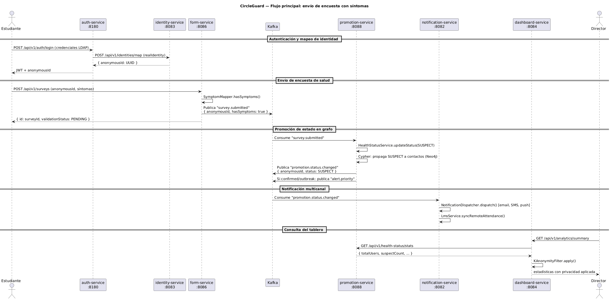
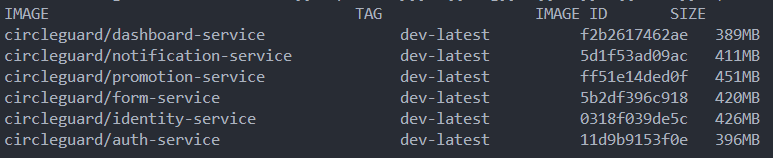
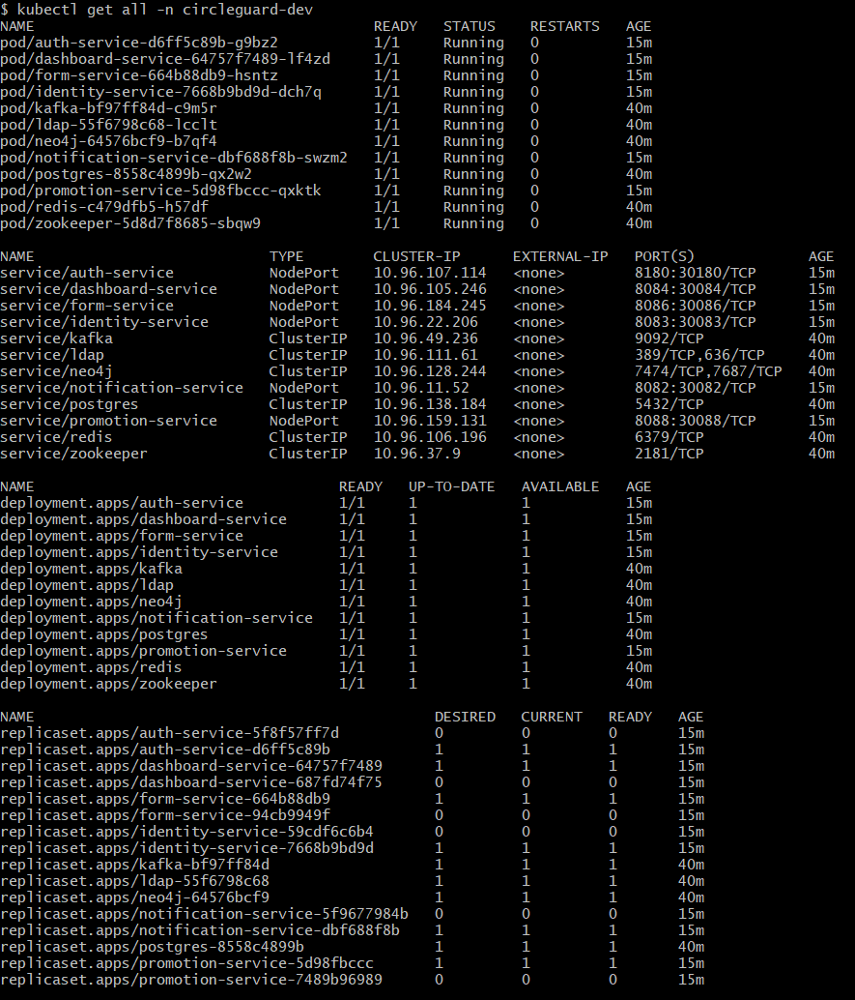
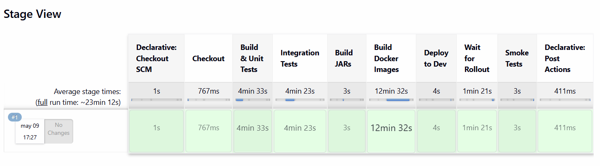
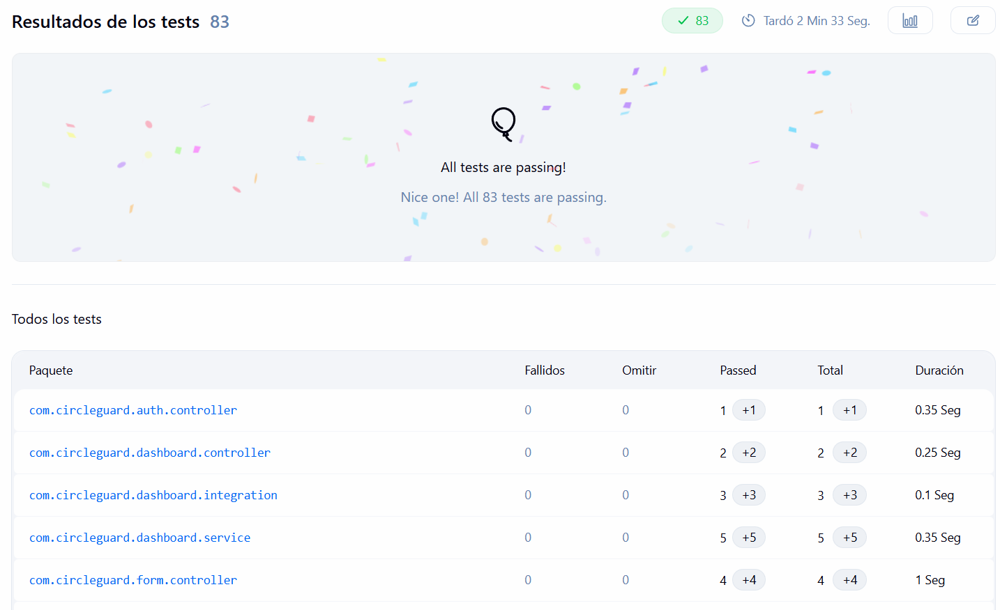

# Taller 2: Pruebas y Lanzamiento — CircleGuard

**Asignatura:** Ingeniería de Software V  
**Fecha de entrega:** 2026-05-02  
**Proyecto:** CircleGuard — Sistema de rastreo de contactos universitario  
**Repositorio:** circle-guard-public  

---

## 1. Introducción y selección de microservicios

CircleGuard es un sistema de rastreo de contactos diseñado para entornos universitarios. Su arquitectura se basa en ocho microservicios implementados con Java 21 y Spring Boot 3.2.4, que se comunican tanto de forma síncrona mediante HTTP/REST como de forma asíncrona a través de Apache Kafka. Para este taller se seleccionaron seis de esos microservicios atendiendo al criterio explícito del enunciado: que los servicios escogidos se comuniquen entre sí de manera que sea posible implementar pruebas que los involucren en conjunto.

Los seis servicios seleccionados son `circleguard-auth-service` (puerto 8180), `circleguard-identity-service` (puerto 8083), `circleguard-form-service` (puerto 8086), `circleguard-promotion-service` (puerto 8088), `circleguard-notification-service` (puerto 8082) y `circleguard-dashboard-service` (puerto 8084). Juntos conforman la cadena funcional principal del sistema: desde la autenticación y el mapeo anónimo de identidades, pasando por el envío de encuestas de salud, la promoción automática de estados de riesgo en un grafo Neo4j, hasta el despacho de notificaciones multicanal y la visualización de estadísticas en un tablero de control. Esta cadena involucra comunicación HTTP síncrona entre `auth-service` e `identity-service`, entre `dashboard-service` y `promotion-service`, y comunicación asíncrona por Kafka entre `form-service`, `promotion-service` y `notification-service`.

### 1.1 Diagrama de comunicación entre microservicios

El siguiente diagrama de secuencia representa el flujo principal del sistema, que cubre el caso de uso de envío de encuesta de salud con síntomas y su propagación hasta la notificación al usuario afectado.



---

## 2. Configuración de Jenkins, Docker y Kubernetes (Actividad 1 — 10%)

### 2.1 Dockerfiles por servicio

Se creó un Dockerfile para cada uno de los seis servicios seleccionados, ubicado dentro del directorio de cada microservicio. Todos utilizan la imagen base `eclipse-temurin:21-jre-alpine`, que combina el JRE de Java 21 con una distribución Alpine Linux minimalista, reduciendo significativamente el tamaño final de la imagen frente a alternativas más pesadas como `openjdk:21`. El proceso de construcción de la imagen parte del fat-JAR generado por Gradle y lo expone en el puerto correspondiente a cada servicio.



### 2.2 Manifiestos de Kubernetes

Para el despliegue en Kubernetes se estructuró el directorio `k8s/` con una separación clara entre la infraestructura compartida y los manifiestos de los servicios de aplicación. El archivo `namespaces.yaml` define tres namespaces independientes: `circleguard-dev`, `circleguard-stage` y `circleguard-master`, que corresponden a los tres ambientes del ciclo de entrega.

Dentro del subdirectorio `infrastructure/` se encuentran cuatro manifiestos que despliegan los componentes de infraestructura: PostgreSQL con un `PersistentVolumeClaim` de 5 GiB y un `ConfigMap` que ejecuta el script `init-db.sql` al inicializar el contenedor; Kafka junto con su Zookeeper como par inseparable; Redis en modo de instancia única; y Neo4j con su propio `PersistentVolumeClaim`.

Los manifiestos de los seis servicios de aplicación están separados en dos directorios según el tipo de recurso de Kubernetes. El directorio `k8s/deployments/` contiene un archivo por microservicio con el recurso `Deployment`: una réplica inicial con sondas de disponibilidad (`readinessProbe`) y de vida (`livenessProbe`) apuntando al endpoint estándar de Spring Actuator (`/actuator/health`). Las variables de entorno (cadenas de conexión a bases de datos, URL del broker Kafka, credenciales y URLs de otros servicios) provienen del `ConfigMap` compartido `circleguard-config` y del `Secret` `circleguard-secrets`, referenciados mediante `envFrom:` y `env:`. El directorio `k8s/services/` contiene un recurso `Service` de tipo `NodePort` por microservicio, organizado en tres subdirectorios (`dev/`, `stage/`, `master/`), cada uno con un rango de puertos distinto para evitar conflictos de asignación de NodePort a nivel de clúster: los NodePorts son un recurso global del clúster y no están acotados al namespace.

La dependencia de los servicios respecto de la infraestructura (PostgreSQL, Neo4j, Kafka, Redis) se gestiona exclusivamente mediante las `readinessProbe`: mientras una dependencia no esté disponible, el pod no pasa al estado `Ready` y Kubernetes no le envía tráfico. Se optó por este enfoque en lugar de `initContainers` porque los `initContainers` requieren que las imágenes de utilidades (p. ej. `busybox`) estén en caché o disponibles en Docker Hub en el momento del despliegue; en entornos locales con Docker Desktop eso genera fallos `ErrImagePull` si Docker Hub aplica rate limiting. La `readinessProbe` funciona con la imagen de la aplicación, que ya está disponible localmente.

Esta separación implica también una separación en el ciclo de vida de los despliegues: la infraestructura se despliega una vez por namespace mediante el script `k8s/install-infra.sh` (paso de bootstrap, ejecutado manualmente antes del primer pipeline) y raramente cambia; los servicios de aplicación se despliegan en cada ejecución del pipeline. De esta forma el pipeline no tiene que esperar a que Kafka, Neo4j ni PostgreSQL estén listos en cada build — ya lo están desde el bootstrap.

El archivo `jenkins/config/jenkins-account.yaml` define el control de acceso basado en roles (RBAC) para la cuenta de servicio de Jenkins. Se declara un `ServiceAccount` en el namespace `default` y se crean `Role` y `RoleBinding` en cada uno de los tres namespaces de la aplicación (`circleguard-dev`, `circleguard-stage` y `circleguard-master`), otorgando permisos de lectura, creación, actualización y eliminación sobre `Deployments`, `StatefulSets`, `ReplicaSets`, `Services`, `ConfigMaps`, `PersistentVolumeClaims`, `Pods` y `Pods/portforward`. Adicionalmente, un `ClusterRole` y su correspondiente `ClusterRoleBinding` otorgan permisos sobre recursos de ámbito de clúster como `Namespaces` y `PersistentVolumes`, necesarios para la ejecución de `kubectl apply -f k8s/namespaces.yaml` desde el pipeline.



### 2.3 Configuración de Jenkins

Jenkins actúa como el orquestador central de los pipelines. El `Dockerfile.jenkins` personaliza la imagen oficial `jenkins/jenkins:lts-jdk21` con la instalación de las herramientas necesarias: Docker CLI (para construir imágenes dentro del agente), `kubectl` con versión pinada vía argumento de build (descargado como binario estático), Python 3 con `pip3` (para instalar y ejecutar Locust en los stages de rendimiento) y una identidad Git global (`jenkins@circleguard.ci` / `Jenkins CI`) requerida para la creación de tags Git anotados en el pipeline master. Los plugins esenciales (`workflow-aggregator`, `git`, `kubernetes-cli`, `junit`, `htmlpublisher`, `configuration-as-code`, `job-dsl`, entre otros) se pre-instalan durante el build de la imagen mediante `jenkins-plugin-cli` leyendo el archivo `plugins.txt`, eliminando el paso manual del wizard inicial.

La configuración del controlador de Jenkins se gestiona declarativamente mediante el plugin **Configuration as Code (JCasC)**: el archivo `jenkins/config/casc.yaml` define el usuario administrador, las credenciales (Docker Hub y token de GitHub) y los tres jobs de pipeline apuntando al repositorio Git con sus respectivos `Jenkinsfile.dev`, `Jenkinsfile.stage` y `Jenkinsfile.master`. Las variables sensibles (usuario, contraseñas, tokens, URL del repo) provienen de un archivo `.env` local que el `docker-compose.jenkins.yml` carga vía `env_file:` y JCasC resuelve mediante sustitución `${VAR}` al arrancar el contenedor. Este enfoque permite re-crear todo el entorno Jenkins desde cero sin clics manuales: levantar el contenedor implica que el admin, las credenciales y los tres jobs ya están configurados.

La comunicación con el clúster Kubernetes se realiza mediante el token del `ServiceAccount` `jenkins`, definido en `jenkins/config/jenkins-account.yaml`. El script `jenkins/scripts/setup-k8s-jenkins.sh` aplica el manifiesto RBAC, espera a que el `Secret` `jenkins-token` sea populado por Kubernetes, extrae el token Bearer y la URL del API server (reescrita de `127.0.0.1` a `host.docker.internal`), y los escribe como `K8S_SA_TOKEN` y `K8S_API_SERVER` en el archivo `.env`. JCasC lee esas variables al arrancar el contenedor y crea automáticamente la credencial `k8s-sa-token` en el Credential Store de Jenkins. En los pipelines, cada stage que ejecuta comandos `kubectl` envuelve sus pasos en `withKubeConfig(credentialsId: 'k8s-sa-token', serverUrl: env.K8S_API_SERVER)`, que genera un kubeconfig temporal con autenticación por token Bearer y lo elimina al salir del bloque. El plugin omite la verificación TLS de forma automática cuando no se proporciona un certificado de CA, lo que es adecuado para el clúster local de Docker Desktop. Este enfoque es más cercano al control de acceso de producción: los pipelines se autentican con permisos acotados por RBAC en cada namespace en lugar de usar las credenciales de administrador del clúster.

[Image: Pantalla de Jenkins mostrando los tres pipelines (dev, stage, master) configurados, con sus últimas ejecuciones exitosas]

---

## 3. Pipelines por ambiente (Actividades 2, 4 y 5)

Los tres pipelines comparten el parámetro booleano `SKIP_DOCKER_BUILD` (valor por defecto `false`). Cuando se activa, los stages de compilación de JARs y construcción de imágenes Docker se omiten y el deploy reutiliza la imagen etiquetada como `*-latest` disponible en el daemon Docker local, evitando reconstrucciones completas cuando únicamente se requiere re-ejecutar etapas posteriores como pruebas o despliegue.

### 3.1 Pipeline de desarrollo — `Jenkinsfile.dev`

El pipeline de desarrollo cubre el ciclo básico que permite a un desarrollador verificar que sus cambios son correctos y que el sistema completo funciona en un ambiente aislado. La primera etapa realiza el checkout del repositorio y calcula la variable de entorno `DEPLOY_TAG`: si `SKIP_DOCKER_BUILD` es `false`, el tag es `dev-<BUILD_NUMBER>`; si es `true`, se usa `dev-latest`. A continuación, la etapa de construcción y pruebas unitarias ejecuta todos los tests de los seis servicios en un único comando Gradle con la opción `--continue`, de modo que un fallo en un servicio no impida que los demás completen sus pruebas; los resultados se publican como artefactos JUnit para su visualización en Jenkins.

Cuando `SKIP_DOCKER_BUILD` es `false`, la etapa de compilación de JARs genera los fat-JARs en paralelo y la etapa de construcción de imágenes Docker etiqueta cada imagen con `dev-<BUILD_NUMBER>` y la re-etiqueta como `dev-latest`. La etapa de despliegue aplica los manifiestos de Kubernetes al namespace `circleguard-dev` mediante `kubectl apply` y actualiza la imagen de cada `Deployment` usando `DEPLOY_TAG`. Antes de declarar el pipeline exitoso, la etapa de espera verifica mediante `kubectl rollout status` que todos los deployments han completado su actualización, y la etapa de smoke tests consulta el endpoint `/actuator/health` de cada servicio para confirmar que están respondiendo correctamente.





### 3.2 Pipeline de stage — `Jenkinsfile.stage`

El pipeline de stage amplía el de desarrollo con capas adicionales de validación. Luego de las pruebas unitarias, incluye una etapa de pruebas de integración que activa el perfil Spring `test`, diseñado para habilitar configuraciones de infraestructura embebida más cercanas al ambiente real. La variable `DEPLOY_TAG` se calcula en el Checkout con el valor `stage-<BUILD_NUMBER>` o `stage-latest` según el parámetro `SKIP_DOCKER_BUILD`. Una vez desplegados los servicios en el namespace `circleguard-stage`, se ejecutan pruebas de sistema E2E contra el ambiente desplegado y una prueba de rendimiento baseline con Locust, ejecutado mediante `pip3` con el PATH extendido para incluir `$HOME/.local/bin`, configurada con diez usuarios concurrentes durante sesenta segundos. Esta configuración moderada tiene como propósito establecer una línea base de referencia de rendimiento antes de que cualquier cambio llegue al ambiente master. El reporte HTML generado por Locust se publica como artefacto del build.

[Image: Reporte HTML de Locust del pipeline stage, mostrando gráfica de tiempo de respuesta y throughput durante los 60 segundos de prueba]

[Image: Etapas del pipeline stage en Jenkins, mostrando la etapa de pruebas de integración y performance baseline en verde]

### 3.3 Pipeline de producción (master) — `Jenkinsfile.master`

El pipeline master constituye la puerta final antes del despliegue en producción. Ejecuta la secuencia completa de validación: pruebas unitarias, pruebas de integración, construcción de artefactos, construcción y etiquetado de imágenes Docker con el esquema de versionamiento `v<BUILD_NUMBER>`, despliegue al namespace `circleguard-master` y verificación del rollout. La variable `IMAGE_TAG` se inicializa en el bloque `environment` como `v<BUILD_NUMBER>` y se sobrescribe a `latest` en el Checkout cuando `SKIP_DOCKER_BUILD` es `true`. A continuación ejecuta una suite de pruebas de validación del sistema y una prueba de rendimiento con cincuenta usuarios concurrentes durante ciento veinte segundos, cuyos resultados se exportan en formato HTML y CSV.

La característica más relevante de este pipeline desde la perspectiva de Change Management es la generación automática de release notes, que se describe en la sección 5. El pipeline finaliza con la creación de un tag Git anotado con el número de versión; la identidad del committer está configurada globalmente en el contenedor Jenkins como `Jenkins CI <jenkins@circleguard.ci>`, lo que evita el error `Committer identity unknown` en entornos sin configuración de usuario Git local.

[Image: Etapas del pipeline master en Jenkins mostrando todas las fases completadas, incluyendo Generate Release Notes y Tag Release]

[Image: Artefactos del build master en Jenkins: locust-report-master.html, locust-master*.csv y release-notes-v<N>.md]

---

## 4. Pruebas implementadas (Actividad 3 — 30%)

El enunciado requiere como mínimo cinco pruebas unitarias nuevas, cinco de integración nuevas, cinco E2E nuevas y pruebas de rendimiento con Locust que simulen casos de uso reales. En este taller se implementaron veintitrés pruebas unitarias nuevas, doce de integración, quince E2E y tres escenarios de rendimiento con Locust con perfiles de usuario diferenciados. Todas las pruebas son relevantes sobre funcionalidades reales del sistema y apuntan a validar el comportamiento observable, no la implementación interna.

Para la identificación de los casos de prueba se utiliza el esquema siguiente: `PU` para pruebas unitarias, `PI` para pruebas de integración, `PE` para pruebas E2E y `PR` para pruebas de rendimiento. Las historias de usuario referenciadas corresponden a los flujos funcionales del sistema descritos en la sección 1.

---

### 4.1 Pruebas unitarias

Las pruebas unitarias verifican el comportamiento de componentes individuales en aislamiento, mockeando con Mockito todas las dependencias externas. Los casos se organizan primero por microservicio y luego por clase de prueba, totalizando veintitrés casos nuevos. Cada bloque siguiente agrupa los escenarios del servicio correspondiente.

---

#### circleguard-form-service

##### `HealthSurveyServiceTest`

---

| Campo | Descripción |
|---|---|
| **Identificador Único** | PU-001 |
| **Nombre** | Envío de encuesta sin síntomas publica evento Kafka correcto |
| **Descripción** | Verifica que al enviar una encuesta sin síntomas el servicio guarda la entidad, asigna `hasFever=false` y `hasCough=false`, y publica el evento `survey.submitted` en Kafka con el `anonymousId` como clave y `hasSymptoms=false` en el payload. |
| **Prerrequisitos/Condiciones** | `HealthSurveyRepository`, `QuestionnaireService`, `SymptomMapper` y `KafkaTemplate` mockeados; `SymptomMapper` configurado para retornar `false`. |
| **Entradas** | Objeto `HealthSurvey` con `anonymousId` válido y sin campos de síntomas explícitos. |
| **Acciones** | Se invoca `HealthSurveyService.submitSurvey()` con la encuesta de entrada. |
| **Salida Esperada** | La encuesta retornada tiene un `id` no nulo, `hasFever=false` y `hasCough=false`; `KafkaTemplate.send()` es invocado exactamente una vez con el topic `survey.submitted`. |
| **Criterios de Aceptación** | El test pasa sin excepciones; la verificación de Mockito sobre `kafkaTemplate.send` no genera fallo. |

---

| Campo | Descripción |
|---|---|
| **Identificador Único** | PU-002 |
| **Nombre** | Envío de encuesta con síntomas activa indicadores clínicos |
| **Descripción** | Verifica que cuando el `SymptomMapper` detecta síntomas, el servicio asigna `hasFever=true` y `hasCough=true` en la encuesta antes de persistirla. |
| **Prerrequisitos/Condiciones** | `SymptomMapper` mockeado para retornar `true`; repositorio configurado para retornar la entidad guardada. |
| **Entradas** | Objeto `HealthSurvey` con `anonymousId` válido y sin campos de síntomas. |
| **Acciones** | Se invoca `HealthSurveyService.submitSurvey()`. |
| **Salida Esperada** | La encuesta retornada tiene `hasFever=true` y `hasCough=true`. |
| **Criterios de Aceptación** | Ambos campos booleanos son `true` en la entidad retornada; no se lanza ninguna excepción. |

---

| Campo | Descripción |
|---|---|
| **Identificador Único** | PU-003 |
| **Nombre** | Encuesta con adjunto se crea en estado PENDING |
| **Descripción** | Verifica que cuando la encuesta incluye un `attachmentPath` no nulo, el servicio asigna automáticamente `ValidationStatus.PENDING` antes de persistir. |
| **Prerrequisitos/Condiciones** | No se requiere cuestionario activo; repositorio mockeado para retornar la entidad tal como se recibe. |
| **Entradas** | Objeto `HealthSurvey` con `attachmentPath="/uploads/evidence.pdf"`. |
| **Acciones** | Se invoca `HealthSurveyService.submitSurvey()`; se captura el argumento pasado al repositorio con `ArgumentCaptor`. |
| **Salida Esperada** | El argumento capturado tiene `validationStatus=PENDING`. |
| **Criterios de Aceptación** | El `ArgumentCaptor` confirma que el estado fue asignado antes de persistir; no se lanza excepción. |

---

| Campo | Descripción |
|---|---|
| **Identificador Único** | PU-004 |
| **Nombre** | Validación APPROVED publica evento certificate.validated |
| **Descripción** | Verifica que cuando un administrador aprueba una encuesta con certificado, el servicio publica el evento `certificate.validated` en Kafka con el `adminId` y `status=APPROVED` en el payload. |
| **Prerrequisitos/Condiciones** | Existe en el repositorio una encuesta en estado `PENDING` con `anonymousId` conocido. |
| **Entradas** | `surveyId` válido, `ValidationStatus.APPROVED`, `adminId` de un usuario administrador. |
| **Acciones** | Se invoca `HealthSurveyService.validateSurvey()` con los parámetros de entrada. |
| **Salida Esperada** | `KafkaTemplate.send()` es invocado con el topic `certificate.validated` y el payload contiene `adminId` y `status="APPROVED"`. |
| **Criterios de Aceptación** | La verificación de Mockito confirma que el evento fue publicado exactamente una vez con los datos correctos. |

---

| Campo | Descripción |
|---|---|
| **Identificador Único** | PU-005 |
| **Nombre** | Validación REJECTED no publica evento certificate.validated |
| **Descripción** | Verifica que cuando un administrador rechaza una encuesta, el servicio NO publica el evento `certificate.validated`, ya que solo las aprobaciones deben restaurar el acceso del usuario. |
| **Prerrequisitos/Condiciones** | Existe en el repositorio una encuesta en estado `PENDING`. |
| **Entradas** | `surveyId` válido, `ValidationStatus.REJECTED`, `adminId`. |
| **Acciones** | Se invoca `HealthSurveyService.validateSurvey()`. |
| **Salida Esperada** | `KafkaTemplate.send()` con el topic `certificate.validated` nunca es invocado. |
| **Criterios de Aceptación** | La verificación `verify(kafkaTemplate, never())` pasa sin error; el estado de la encuesta es actualizado a `REJECTED`. |

---

##### `SymptomMapperEdgeCasesTest`

---

| Campo | Descripción |
|---|---|
| **Identificador Único** | PU-006 |
| **Nombre** | Respuestas nulas retornan falso en detección de síntomas |
| **Descripción** | Verifica que `SymptomMapper.hasSymptoms()` retorna `false` sin lanzar excepción cuando el mapa de respuestas del estudiante es `null`. |
| **Prerrequisitos/Condiciones** | Instancia de `SymptomMapper` creada directamente sin Spring (prueba POJO). |
| **Entradas** | `HealthSurvey` con `responses=null`; `Questionnaire` con lista de preguntas vacía. |
| **Acciones** | Se invoca `mapper.hasSymptoms(survey, questionnaire)`. |
| **Salida Esperada** | Retorna `false`. |
| **Criterios de Aceptación** | No se lanza `NullPointerException`; el valor retornado es `false`. |

---

| Campo | Descripción |
|---|---|
| **Identificador Único** | PU-007 |
| **Nombre** | Dificultad respiratoria es detectada como síntoma |
| **Descripción** | Verifica que una respuesta afirmativa a una pregunta cuyo texto contiene la palabra "breathing" activa la detección de síntomas, pues el mapper reconoce dicho término como indicador clínico. |
| **Prerrequisitos/Condiciones** | Cuestionario con una pregunta de tipo `YES_NO` cuyo texto es "Do you have difficulty breathing?". |
| **Entradas** | Respuesta `YES` a la pregunta de dificultad respiratoria. |
| **Acciones** | Se invoca `mapper.hasSymptoms(survey, questionnaire)`. |
| **Salida Esperada** | Retorna `true`. |
| **Criterios de Aceptación** | El valor booleano retornado es `true`; no se lanza excepción. |

---

| Campo | Descripción |
|---|---|
| **Identificador Único** | PU-008 |
| **Nombre** | Respuesta afirmativa en pregunta no clínica no activa síntomas |
| **Descripción** | Verifica que responder "YES" a una pregunta cuyo texto no contiene términos clínicos reconocidos (fever, cough, breathing) no activa la detección de síntomas. |
| **Prerrequisitos/Condiciones** | Cuestionario con una pregunta de tipo `YES_NO` cuyo texto es "Have you been vaccinated?". |
| **Entradas** | Respuesta `YES` a la pregunta de vacunación. |
| **Acciones** | Se invoca `mapper.hasSymptoms(survey, questionnaire)`. |
| **Salida Esperada** | Retorna `false`. |
| **Criterios de Aceptación** | El valor booleano retornado es `false`; el mapper no confunde preguntas epidemiológicas irrelevantes con síntomas. |

---

| Campo | Descripción |
|---|---|
| **Identificador Único** | PU-009 |
| **Nombre** | Cuestionario con lista de preguntas vacía retorna falso |
| **Descripción** | Verifica que cuando el cuestionario activo no contiene preguntas, el mapper retorna `false` sin importar el contenido del mapa de respuestas. |
| **Prerrequisitos/Condiciones** | Cuestionario con `questions=emptyList()`; encuesta con alguna respuesta arbitraria. |
| **Entradas** | `HealthSurvey` con respuestas presentes; `Questionnaire` con preguntas vacías. |
| **Acciones** | Se invoca `mapper.hasSymptoms(survey, questionnaire)`. |
| **Salida Esperada** | Retorna `false`. |
| **Criterios de Aceptación** | No se lanza excepción; retorna `false`. |

---

| Campo | Descripción |
|---|---|
| **Identificador Único** | PU-010 |
| **Nombre** | Detección de tos entre múltiples preguntas mixtas |
| **Descripción** | Verifica que cuando un cuestionario contiene preguntas clínicas y no clínicas mezcladas, el mapper detecta correctamente el síntoma de tos aunque otras preguntas no estén relacionadas con síntomas. |
| **Prerrequisitos/Condiciones** | Cuestionario con dos preguntas: "Have you traveled recently?" y "Do you have a cough?". |
| **Entradas** | Respuesta `YES` a ambas preguntas. |
| **Acciones** | Se invoca `mapper.hasSymptoms(survey, questionnaire)`. |
| **Salida Esperada** | Retorna `true` porque al menos una pregunta con "cough" tiene respuesta afirmativa. |
| **Criterios de Aceptación** | El valor retornado es `true`; el mapper identifica correctamente el término clínico. |

---

#### circleguard-identity-service

##### `IdentityVaultServiceTest`

---

| Campo | Descripción |
|---|---|
| **Identificador Único** | PU-011 |
| **Nombre** | Misma identidad real siempre retorna el mismo UUID anónimo |
| **Descripción** | Verifica la propiedad de idempotencia del servicio de bóveda de identidades: dos invocaciones con la misma identidad real deben retornar exactamente el mismo `anonymousId`. Esta propiedad es fundamental para la privacidad diferencial del sistema. |
| **Prerrequisitos/Condiciones** | El repositorio retorna un `IdentityMapping` existente al consultar por hash; `hashSalt` configurado vía `ReflectionTestUtils`. |
| **Entradas** | Cadena `"student@university.edu"` enviada dos veces. |
| **Acciones** | Se invoca `getOrCreateAnonymousId()` dos veces con el mismo argumento; se comparan los resultados. |
| **Salida Esperada** | Ambas invocaciones retornan el mismo `UUID`; el repositorio nunca invoca `save()`. |
| **Criterios de Aceptación** | `assertEquals(result1, result2)`; `verify(repository, never()).save(any())`. |

---

| Campo | Descripción |
|---|---|
| **Identificador Único** | PU-012 |
| **Nombre** | Nueva identidad se persiste con UUID y salt generados |
| **Descripción** | Verifica que cuando una identidad no existe en el repositorio, el servicio crea un nuevo `IdentityMapping` con `realIdentity`, `identityHash` y un `salt` generado aleatoriamente, y lo persiste llamando a `repository.save()`. |
| **Prerrequisitos/Condiciones** | El repositorio retorna `Optional.empty()` al consultar por hash; `save()` configurado para asignar un UUID al mapping. |
| **Entradas** | Cadena `"new.student@university.edu"` no registrada previamente. |
| **Acciones** | Se invoca `getOrCreateAnonymousId()`; se captura el argumento de `save()` con `ArgumentCaptor`. |
| **Salida Esperada** | El `ArgumentCaptor` confirma que `realIdentity` coincide con la entrada y que `salt` no es nulo. |
| **Criterios de Aceptación** | `verify(repository).save(captor)` pasa; el UUID retornado coincide con el asignado por el mock del repositorio. |

---

| Campo | Descripción |
|---|---|
| **Identificador Único** | PU-013 |
| **Nombre** | Identidades distintas producen UUIDs distintos |
| **Descripción** | Verifica que dos identidades reales diferentes producen identificadores anónimos distintos, lo que garantiza que no hay colisiones en el espacio de identificadores. |
| **Prerrequisitos/Condiciones** | El repositorio retorna `Optional.empty()` para cualquier hash; `save()` genera un UUID aleatorio en cada llamada. |
| **Entradas** | `"alice@uni.edu"` y `"bob@uni.edu"` como dos identidades distintas. |
| **Acciones** | Se invocan dos llamadas a `getOrCreateAnonymousId()` con cada identidad. |
| **Salida Esperada** | Los dos UUIDs retornados son distintos entre sí; `save()` es invocado exactamente dos veces. |
| **Criterios de Aceptación** | `assertNotEquals(id1, id2)`; `verify(repository, times(2)).save(any())`. |

---

| Campo | Descripción |
|---|---|
| **Identificador Único** | PU-014 |
| **Nombre** | UUID desconocido lanza excepción 404 al resolver identidad |
| **Descripción** | Verifica que cuando se solicita resolver un `anonymousId` que no existe en el repositorio, el servicio lanza `ResponseStatusException` con código HTTP 404, en lugar de retornar un valor nulo. |
| **Prerrequisitos/Condiciones** | El repositorio retorna `Optional.empty()` para el UUID consultado. |
| **Entradas** | Un UUID aleatorio no registrado en el sistema. |
| **Acciones** | Se invoca `resolveRealIdentity()` con el UUID desconocido. |
| **Salida Esperada** | Se lanza `ResponseStatusException` con `HttpStatus.NOT_FOUND`. |
| **Criterios de Aceptación** | `assertThrows(ResponseStatusException.class, ...)` pasa. |

---

| Campo | Descripción |
|---|---|
| **Identificador Único** | PU-015 |
| **Nombre** | UUID conocido resuelve correctamente la identidad real |
| **Descripción** | Verifica que cuando se solicita resolver un `anonymousId` registrado, el servicio retorna la cadena de identidad real original almacenada en el `IdentityMapping`. |
| **Prerrequisitos/Condiciones** | El repositorio retorna un `IdentityMapping` con `realIdentity="known.student@university.edu"`. |
| **Entradas** | El UUID anónimo asociado a la identidad registrada. |
| **Acciones** | Se invoca `resolveRealIdentity()` con el UUID. |
| **Salida Esperada** | Retorna `"known.student@university.edu"`. |
| **Criterios de Aceptación** | `assertEquals("known.student@university.edu", result)`. |

---

#### circleguard-promotion-service

##### `StatusLifecycleServiceTest`

---

| Campo | Descripción |
|---|---|
| **Identificador Único** | PU-016 |
| **Nombre** | Transición automática sin usuarios expirados no publica eventos |
| **Descripción** | Verifica que cuando la consulta Cypher de usuarios en estado SUSPECT/PROBABLE con ventana expirada no retorna resultados, el servicio no publica ningún evento Kafka y no actualiza Redis. |
| **Prerrequisitos/Condiciones** | `SystemSettings` con `mandatoryFenceDays=14`; Neo4j mockeado para retornar lista vacía de IDs liberados. |
| **Entradas** | Ninguna entrada explícita; el método es invocado por el scheduler. |
| **Acciones** | Se invoca `processAutomaticTransitions()` directamente. |
| **Salida Esperada** | `KafkaTemplate.send()` nunca es invocado; `redisTemplate.opsForValue().multiSet()` nunca es invocado. |
| **Criterios de Aceptación** | `verify(kafkaTemplate, never()).send(...)` pasa. |

---

| Campo | Descripción |
|---|---|
| **Identificador Único** | PU-017 |
| **Nombre** | Usuarios con ventana expirada son liberados y notificados por Kafka |
| **Descripción** | Verifica que cuando existen usuarios cuyo estado de riesgo ha superado el período de cuarentena obligatoria, el servicio publica un evento `promotion.status.changed` por cada usuario liberado y actualiza Redis en lote. |
| **Prerrequisitos/Condiciones** | Neo4j mockeado para retornar dos IDs `["user-001", "user-002"]` como usuarios liberados; Redis y Kafka mockeados. |
| **Entradas** | Ninguna entrada explícita; el método es invocado directamente en el test. |
| **Acciones** | Se invoca `processAutomaticTransitions()`; se verifican las interacciones con Kafka y Redis. |
| **Salida Esperada** | `KafkaTemplate.send()` es invocado exactamente dos veces con el topic `promotion.status.changed`. |
| **Criterios de Aceptación** | `verify(kafkaTemplate, times(2)).send(eq("promotion.status.changed"), ...)` pasa. |

---

| Campo | Descripción |
|---|---|
| **Identificador Único** | PU-018 |
| **Nombre** | Ausencia de SystemSettings lanza IllegalStateException |
| **Descripción** | Verifica que cuando el repositorio de configuración del sistema no retorna ninguna entrada, el método lanza `IllegalStateException` en lugar de operar con valores nulos o por defecto silenciosos. |
| **Prerrequisitos/Condiciones** | `SystemSettingsRepository` mockeado para retornar `Optional.empty()`. |
| **Entradas** | Ninguna; el método es invocado sin configuración previa. |
| **Acciones** | Se invoca `processAutomaticTransitions()`; se espera excepción. |
| **Salida Esperada** | Se lanza `IllegalStateException`. |
| **Criterios de Aceptación** | `assertThrows(IllegalStateException.class, ...)` pasa. |

---

#### circleguard-dashboard-service

##### `AnalyticsServiceTest`

---

| Campo | Descripción |
|---|---|
| **Identificador Único** | PU-019 |
| **Nombre** | Resumen campus delega correctamente al PromotionClient |
| **Descripción** | Verifica que `AnalyticsService.getCampusSummary()` delega la consulta al `PromotionClient` y retorna exactamente el mapa recibido, sin modificar sus valores. |
| **Prerrequisitos/Condiciones** | `PromotionClient` mockeado para retornar un mapa con `totalUsers=500` y `confirmedCount=3`. |
| **Entradas** | Ninguna entrada explícita; consulta sin parámetros. |
| **Acciones** | Se invoca `getCampusSummary()`; se verifica el resultado y la interacción con el client. |
| **Salida Esperada** | El mapa retornado es igual al retornado por el mock; `getHealthStats()` es invocado exactamente una vez. |
| **Criterios de Aceptación** | `assertEquals(expected, result)`; `verify(promotionClient).getHealthStats()`. |

---

| Campo | Descripción |
|---|---|
| **Identificador Único** | PU-020 |
| **Nombre** | Departamento con población pequeña activa enmascaramiento K-Anonymity |
| **Descripción** | Verifica que cuando el `PromotionClient` retorna estadísticas de un departamento con menos de cinco usuarios (`totalUsers=2`), el servicio aplica el filtro K-Anonymity que reemplaza el valor por `"<5"` y agrega una nota de privacidad. |
| **Prerrequisitos/Condiciones** | `PromotionClient` mockeado para retornar `{totalUsers: 2, department: "Mathematics"}`. |
| **Entradas** | Nombre de departamento `"Mathematics"`. |
| **Acciones** | Se invoca `getDepartmentStats("Mathematics")`; se inspeccionan los campos del mapa retornado. |
| **Salida Esperada** | El campo `totalUsers` en el resultado es `"<5"`; el mapa contiene la clave `"note"`. |
| **Criterios de Aceptación** | `assertEquals("<5", result.get("totalUsers"))`; `assertTrue(result.containsKey("note"))`. |

---

| Campo | Descripción |
|---|---|
| **Identificador Único** | PU-021 |
| **Nombre** | Departamento con población suficiente no es enmascarado |
| **Descripción** | Verifica que cuando la población del departamento es igual o superior al umbral K (cinco usuarios), el filtro de privacidad no modifica el campo `totalUsers` ni agrega notas de enmascaramiento. |
| **Prerrequisitos/Condiciones** | `PromotionClient` mockeado para retornar `{totalUsers: 100, confirmedCount: 2}`. |
| **Entradas** | Nombre de departamento `"Engineering"`. |
| **Acciones** | Se invoca `getDepartmentStats("Engineering")`; se inspeccionan los campos del resultado. |
| **Salida Esperada** | `totalUsers` retorna el valor numérico original `100`; no existe la clave `"note"`. |
| **Criterios de Aceptación** | `assertEquals(100, result.get("totalUsers"))`; `assertFalse(result.containsKey("note"))`. |

---

| Campo | Descripción |
|---|---|
| **Identificador Único** | PU-022 |
| **Nombre** | Tabla de series de tiempo inexistente retorna datos mock |
| **Descripción** | Verifica que cuando la consulta SQL a la tabla `status_events` falla porque la tabla no existe (ambiente nuevo o de prueba), el servicio retorna una lista de datos mock generados internamente en lugar de propagar la excepción. |
| **Prerrequisitos/Condiciones** | `JdbcTemplate` mockeado para lanzar `RuntimeException("Table not found")`. |
| **Entradas** | Parámetros `period="hourly"` y `limit=5`. |
| **Acciones** | Se invoca `getTimeSeries("hourly", 5)`; se inspecciona el resultado. |
| **Salida Esperada** | La lista retornada no está vacía; cada elemento contiene las claves `"status"` y `"total"`. |
| **Criterios de Aceptación** | `assertFalse(result.isEmpty())`; cada elemento del stream contiene las claves esperadas. |

---

| Campo | Descripción |
|---|---|
| **Identificador Único** | PU-023 |
| **Nombre** | Período diario consulta con truncación por día |
| **Descripción** | Verifica que cuando se solicita el período `"daily"`, el servicio construye la consulta SQL con truncación por día y retorna los datos del repositorio correctamente. |
| **Prerrequisitos/Condiciones** | `JdbcTemplate` mockeado para retornar una fila cuando la consulta contiene la cadena `"day"`. |
| **Entradas** | Parámetros `period="daily"` y `limit=10`. |
| **Acciones** | Se invoca `getTimeSeries("daily", 10)`; se verifica el argumento de `queryForList`. |
| **Salida Esperada** | La lista no está vacía; el primer elemento contiene `status="ACTIVE"`. |
| **Criterios de Aceptación** | `assertFalse(result.isEmpty())`; el valor de `"status"` en el primer elemento es `"ACTIVE"`. |

---

[Image: Resultado de ejecución de las 23 pruebas unitarias nuevas en el IDE, mostrando todas en verde con sus tiempos de ejecución]

---

### 4.2 Pruebas de integración

Las pruebas de integración verifican que varios componentes funcionan correctamente cuando se conectan entre sí dentro del contexto completo de Spring Boot. A diferencia de las pruebas unitarias, estas cargan el contexto Spring real y se ejecutan contra instancias embebidas de la infraestructura real (Kafka, Neo4j, Redis y PostgreSQL), que corren dentro de la misma JVM del proceso de pruebas. Esto permite validar serialización, consumo desde topics, recorridos de grafo y cacheo en condiciones equivalentes a producción sin requerir Docker ni conectividad de red externa.

Apache Kafka se instancia con `spring-kafka-test` mediante la anotación `@EmbeddedKafka(partitions = 1, topics = {...})`, que arranca un broker Kafka in-process al cual los `KafkaTemplate` y los `@KafkaListener` reales del servicio bajo prueba se conectan automáticamente al sobrescribir `spring.kafka.bootstrap-servers` con `${spring.embedded.kafka.brokers}`. Los tests que publican usan un consumidor adicional creado con `KafkaTestUtils.consumerProps()` para verificar el contenido y la clave del registro emitido; los tests que consumen usan `ContainerTestUtils.waitForAssignment()` para esperar a que el listener se una al grupo antes de publicar, y `Awaitility` para esperar de forma determinista a que las dependencias mockeadas downstream sean invocadas. Neo4j se instancia con `neo4j-harness:5.26.0` en modo in-process mediante `Neo4jBuilders.newInProcessBuilder()`, lo que habilita el protocolo Bolt real y permite ejecutar consultas Cypher completas. Redis se instancia con `jedis-mock:1.1.0`, una implementación Java del protocolo RESP que recibe y responde comandos Redis reales a través de red sin binario nativo. Para la capa JPA/PostgreSQL se utiliza H2 en modo de compatibilidad PostgreSQL, configurado mediante el perfil Spring `test` con DDL automático y Flyway deshabilitado.

Se crearon cinco nuevas clases de prueba de integración con un total de doce casos.

---

#### circleguard-form-service

##### `SurveyKafkaPublishIntegrationTest`

---

| Campo | Descripción |
|---|---|
| **Identificador Único** | PI-001 |
| **Nombre** | Payload de survey.submitted contiene campos obligatorios |
| **Descripción** | Verifica, con el contexto Spring completo cargado y un broker Kafka embebido (`@EmbeddedKafka`), que al invocar `HealthSurveyService.submitSurvey()` el `KafkaTemplate` real publica un registro en el topic `survey.submitted` cuya clave es el `anonymousId` y cuyo payload contiene los campos `anonymousId`, `hasSymptoms=true` y `timestamp`. |
| **Prerrequisitos/Condiciones** | Contexto Spring cargado con perfil `test`; broker Kafka embebido con el topic creado; repositorio, `QuestionnaireService` y `SymptomMapper` mockeados como `@MockBean`; consumidor de prueba suscrito al topic vía `KafkaTestUtils.consumerProps()`. |
| **Entradas** | `HealthSurvey` con `anonymousId` válido; cuestionario con una pregunta de fiebre; `SymptomMapper` configurado para retornar `true`. |
| **Acciones** | Se invoca `submitSurvey()`; el consumidor del test recupera el registro con `KafkaTestUtils.getSingleRecord(topic, Duration.ofSeconds(10))`. |
| **Salida Esperada** | El registro consumido tiene `key = anonymousId.toString()` y el payload contiene `anonymousId`, `hasSymptoms=true` y `timestamp` no nulo. |
| **Criterios de Aceptación** | El registro llega al topic dentro del timeout y los tres campos del payload coinciden con los esperados. |

---

| Campo | Descripción |
|---|---|
| **Identificador Único** | PI-002 |
| **Nombre** | Payload de certificate.validated contiene adminId y estado APPROVED |
| **Descripción** | Verifica que al aprobar un certificado, el evento `certificate.validated` publicado en el broker Kafka embebido contiene el `adminId` del aprobador y el campo `status="APPROVED"`, garantizando la trazabilidad de la validación. |
| **Prerrequisitos/Condiciones** | Contexto Spring cargado con broker Kafka embebido y topic `certificate.validated`; encuesta en estado `PENDING` disponible en el repositorio mockeado; consumidor de prueba suscrito al topic. |
| **Entradas** | `surveyId`, `ValidationStatus.APPROVED`, `adminId` del administrador. |
| **Acciones** | Se invoca `validateSurvey()`; el consumidor del test lee el registro emitido al topic. |
| **Salida Esperada** | El payload contiene `status="APPROVED"` y `adminId` coincide con el identificador serializado del administrador. |
| **Criterios de Aceptación** | `KafkaTestUtils.getSingleRecord()` retorna el registro dentro del timeout y ambos campos coinciden. |

---

#### circleguard-promotion-service

##### `SurveyListenerToServiceIntegrationTest`

---

| Campo | Descripción |
|---|---|
| **Identificador Único** | PI-003 |
| **Nombre** | SurveyListener con síntomas invoca actualización a estado SUSPECT |
| **Descripción** | Verifica el flujo Kafka completo en `promotion-service`: un evento publicado al topic `survey.submitted` en el broker embebido es consumido por el `@KafkaListener` real (`SurveyListener`), que delega la actualización de estado al `HealthStatusService` cuando `hasSymptoms=true`. |
| **Prerrequisitos/Condiciones** | Contexto Spring cargado con perfil `test`; broker Kafka embebido con topic `survey.submitted`; `HealthStatusService` mockeado como `@MockBean`; el listener real registrado en el `KafkaListenerEndpointRegistry`; espera a la asignación de partición vía `ContainerTestUtils.waitForAssignment()`. |
| **Entradas** | Mapa de evento con `anonymousId="integration-user-001"` y `hasSymptoms=true` publicado al topic con `KafkaTemplate`. |
| **Acciones** | Se publica el evento al topic; `Awaitility.await()` espera a que el listener consuma y delegue. |
| **Salida Esperada** | `healthStatusService.updateStatus("integration-user-001", "SUSPECT")` es invocado dentro del timeout. |
| **Criterios de Aceptación** | `await().atMost(10s).untilAsserted(verify(...))` completa sin timeout. |

---

| Campo | Descripción |
|---|---|
| **Identificador Único** | PI-004 |
| **Nombre** | SurveyListener sin síntomas no actualiza estado de salud |
| **Descripción** | Verifica que cuando el evento `survey.submitted` indica `hasSymptoms=false`, el listener consume el mensaje del broker pero no invoca `HealthStatusService`, evitando cambios de estado innecesarios y reduciendo la carga en el grafo Neo4j. |
| **Prerrequisitos/Condiciones** | Contexto Spring cargado; broker Kafka embebido; `HealthStatusService` mockeado; listener registrado y con partición asignada. |
| **Entradas** | Mapa de evento con `anonymousId="integration-user-002"` y `hasSymptoms=false` publicado al topic. |
| **Acciones** | Se publica el evento; tras un `pollDelay` de 3 segundos se verifica que el mock no fue invocado. |
| **Salida Esperada** | `healthStatusService.updateStatus()` nunca es invocado. |
| **Criterios de Aceptación** | `verify(healthStatusService, never()).updateStatus(anyString(), anyString())` pasa después del polling. |

---

#### circleguard-dashboard-service

##### `DashboardPromotionClientIntegrationTest`

---

| Campo | Descripción |
|---|---|
| **Identificador Único** | PI-005 |
| **Nombre** | getCampusSummary retorna datos del PromotionClient en contexto Spring |
| **Descripción** | Verifica que con el contexto Spring completo cargado, `AnalyticsService.getCampusSummary()` delega correctamente al `PromotionClient` y retorna la respuesta sin modificación, validando que el bean `PromotionClient` está correctamente inyectado. |
| **Prerrequisitos/Condiciones** | `PromotionClient` mockeado como `@MockBean` en contexto Spring; retorna un mapa con `totalUsers=350`. |
| **Entradas** | Ninguna entrada; consulta sin parámetros. |
| **Acciones** | Se invoca `analyticsService.getCampusSummary()` a través del bean inyectado por Spring. |
| **Salida Esperada** | El resultado tiene `totalUsers=350`; `promotionClient.getHealthStats()` es invocado exactamente una vez. |
| **Criterios de Aceptación** | `assertEquals(350, result.get("totalUsers"))`; `verify(promotionClient, times(1)).getHealthStats()`. |

---

| Campo | Descripción |
|---|---|
| **Identificador Único** | PI-006 |
| **Nombre** | Departamento con población menor a K es enmascarado en contexto Spring |
| **Descripción** | Verifica que con el contexto Spring completo, la cadena `AnalyticsService → PromotionClient → KAnonymityFilter` aplica correctamente el enmascaramiento cuando la población del departamento es inferior al umbral de privacidad. |
| **Prerrequisitos/Condiciones** | `PromotionClient` mockeado para retornar `{totalUsers: 3, department: "Philosophy"}`. |
| **Entradas** | Nombre de departamento `"Philosophy"`. |
| **Acciones** | Se invoca `getDepartmentStats("Philosophy")`. |
| **Salida Esperada** | `totalUsers` es `"<5"` en el resultado; el mapa contiene la clave `"note"`. |
| **Criterios de Aceptación** | `assertEquals("<5", result.get("totalUsers"))`; `assertTrue(result.containsKey("note"))`. |

---

| Campo | Descripción |
|---|---|
| **Identificador Único** | PI-007 |
| **Nombre** | Fallo del PromotionClient retorna mapa de error sin excepción |
| **Descripción** | Verifica que cuando el `PromotionClient` retorna un mapa con la clave `"error"` (comportamiento de fallback ante fallo HTTP), el `AnalyticsService` no lanza excepción y retorna el mapa de error al cliente del dashboard. |
| **Prerrequisitos/Condiciones** | `PromotionClient` mockeado para retornar `{error: "Service unavailable"}`. |
| **Entradas** | Ninguna entrada; consulta sin parámetros. |
| **Acciones** | Se invoca `getCampusSummary()`; se inspecciona el resultado. |
| **Salida Esperada** | El resultado no es nulo y contiene la clave `"error"`. |
| **Criterios de Aceptación** | `assertTrue(result.containsKey("error"))`; no se lanza ninguna excepción. |

---

#### circleguard-notification-service

##### `StatusChangeNotificationIntegrationTest`

---

| Campo | Descripción |
|---|---|
| **Identificador Único** | PI-008 |
| **Nombre** | Evento de estado SUSPECT despacha notificación y sincroniza LMS |
| **Descripción** | Verifica que un evento JSON con `status=SUSPECT` publicado en el broker Kafka embebido al topic `promotion.status.changed` es consumido por el `ExposureNotificationListener` real, que delega tanto al `NotificationDispatcher` como al `LmsService`, integrando en un único test el flujo completo Kafka → listener → dependencias downstream. |
| **Prerrequisitos/Condiciones** | Contexto Spring cargado; broker Kafka embebido con el topic `promotion.status.changed`; `NotificationDispatcher`, `LmsService`, servicios de email/sms/push mockeados como `@MockBean`; espera a la asignación de partición. |
| **Entradas** | Cadena JSON `{"anonymousId":"user-int-001","status":"SUSPECT","timestamp":1234567890}` publicada al topic con `KafkaTemplate<String,String>`. |
| **Acciones** | Se publica el mensaje; `Awaitility` espera a que ambas dependencias mockeadas sean invocadas. |
| **Salida Esperada** | `dispatcher.dispatch("user-int-001", "SUSPECT")` invocado una vez; `lmsService.syncRemoteAttendance("user-int-001", "SUSPECT")` invocado una vez. |
| **Criterios de Aceptación** | `await().atMost(10s).untilAsserted(...)` completa sin timeout y ambas verificaciones de Mockito pasan. |

---

| Campo | Descripción |
|---|---|
| **Identificador Único** | PI-009 |
| **Nombre** | Evento de estado ACTIVE no genera notificaciones |
| **Descripción** | Verifica que el estado `ACTIVE`, que es el estado normal del sistema, no genera notificaciones ni sincronizaciones con el LMS, evitando ruido en los canales de comunicación. El mensaje se publica al broker embebido y el listener lo consume; la lógica del listener no debe disparar las dependencias downstream. |
| **Prerrequisitos/Condiciones** | Contexto Spring cargado; broker Kafka embebido; `NotificationDispatcher` y `LmsService` mockeados; listener con partición asignada. |
| **Entradas** | Cadena JSON `{"anonymousId":"user-int-002","status":"ACTIVE","timestamp":1234567890}` publicada al topic. |
| **Acciones** | Se publica el mensaje; tras un `pollDelay` de 3 segundos se verifican los mocks. |
| **Salida Esperada** | `dispatcher.dispatch()` nunca es invocado; `lmsService.syncRemoteAttendance()` nunca es invocado. |
| **Criterios de Aceptación** | Ambas verificaciones `verify(..., never())` pasan después del polling. |

---

| Campo | Descripción |
|---|---|
| **Identificador Único** | PI-010 |
| **Nombre** | JSON malformado no lanza excepción ni despacha notificación |
| **Descripción** | Verifica la resiliencia del consumidor Kafka ante mensajes corruptos: cuando el listener consume un mensaje del broker embebido cuyo contenido no es JSON válido, lo maneja silenciosamente (try/catch interno) sin propagar la excepción, garantizando que el pod no falla y el consumer group no queda bloqueado. |
| **Prerrequisitos/Condiciones** | Contexto Spring cargado; broker Kafka embebido; `NotificationDispatcher` mockeado; listener con partición asignada. |
| **Entradas** | Cadena malformada `"THIS IS NOT JSON {{{}}}"` publicada al topic con `KafkaTemplate<String,String>`. |
| **Acciones** | Se publica el mensaje al topic; tras un `pollDelay` se verifica que el dispatcher no fue invocado y que el consumer no quedó atascado. |
| **Salida Esperada** | El listener no propaga excepción y `dispatcher.dispatch()` nunca es invocado. |
| **Criterios de Aceptación** | El test no falla por excepción y `verify(dispatcher, never()).dispatch(...)` pasa después del polling. |

---

#### circleguard-identity-service

##### `IdentityMappingIntegrationTest`

---

| Campo | Descripción |
|---|---|
| **Identificador Único** | PI-011 |
| **Nombre** | POST /identities/map retorna anonymousId UUID válido |
| **Descripción** | Verifica la capa HTTP completa del `IdentityVaultController` mediante `MockMvc`: que una petición `POST` al endpoint de mapeo con un cuerpo JSON válido recibe una respuesta 200 con el campo `anonymousId` en el body. |
| **Prerrequisitos/Condiciones** | Contexto Spring cargado con `@WebMvcTest`; `IdentityVaultService` y `KafkaTemplate` mockeados; usuario autenticado con `@WithMockUser`. |
| **Entradas** | Body JSON `{"realIdentity":"student@university.edu"}`; token CSRF incluido. |
| **Acciones** | Se realiza `mockMvc.perform(post("/api/v1/identities/map"))` con el body. |
| **Salida Esperada** | Estado HTTP 200; el JSON de respuesta contiene el campo `anonymousId`. |
| **Criterios de Aceptación** | `status().isOk()` y `jsonPath("$.anonymousId").exists()` pasan. |

---

| Campo | Descripción |
|---|---|
| **Identificador Único** | PI-012 |
| **Nombre** | POST /identities/visitor crea mapping compuesto con prefijo VISITOR |
| **Descripción** | Verifica que el endpoint de registro de visitantes construye el identificador compuesto con el prefijo `VISITOR|` concatenando email, nombre y motivo de visita, antes de delegar al servicio de bóveda. Esta construcción garantiza que los visitantes externos no colisionen con el espacio de identidades de estudiantes y docentes. |
| **Prerrequisitos/Condiciones** | Mismo contexto que PI-011; `vaultService` configurado para retornar un UUID al recibir cualquier cadena. |
| **Entradas** | Body JSON con `name`, `email` y `reason_for_visit`; token CSRF. |
| **Acciones** | Se realiza `mockMvc.perform(post("/api/v1/identities/visitor"))`. |
| **Salida Esperada** | Estado HTTP 200; `vaultService.getOrCreateAnonymousId()` es invocado con un argumento que comienza con `"VISITOR|"` y contiene el email del visitante. |
| **Criterios de Aceptación** | `status().isOk()` pasa; `verify(vaultService).getOrCreateAnonymousId(argThat(id -> id.startsWith("VISITOR|") && id.contains("visitor@external.com")))` pasa. |

---

[Image: Resultado de ejecución de las 12 pruebas de integración en Jenkins, mostrando logs de inicialización del contexto Spring y todos los tests en verde]

---

### 4.3 Pruebas E2E

Las pruebas end-to-end validan flujos completos de usuario contra los servicios realmente desplegados, sin mocks de ningún tipo. Están implementadas con la librería RestAssured y organizadas en un módulo Gradle independiente en `tests/e2e/`, de modo que puedan ejecutarse de forma aislada contra cualquier ambiente especificando las URLs y puertos mediante propiedades del sistema. El diseño contempla que los servicios pueden no estar disponibles en todos los ambientes, por lo que cada prueba acepta el código HTTP 503 como respuesta válida sin fallar, pero verifica las propiedades funcionales cuando el servicio sí responde con 200.

---

#### circleguard-form-service

##### `HealthSurveyFlowE2ETest`

---

| Campo | Descripción |
|---|---|
| **Identificador Único** | PE-001 |
| **Nombre** | identity-service responde UP en el endpoint de salud |
| **Descripción** | Verifica que el `identity-service` desplegado en Kubernetes responde al endpoint `/actuator/health` con estado HTTP 200 y body `{"status":"UP"}`, confirmando que el pod está en estado operativo. |
| **Prerrequisitos/Condiciones** | `identity-service` desplegado y con `readinessProbe` completada en el namespace objetivo. |
| **Entradas** | Petición GET a `/actuator/health` en el host y puerto configurados por propiedades de sistema. |
| **Acciones** | Se realiza la petición HTTP; se valida el código de estado y el body. |
| **Salida Esperada** | HTTP 200; body contiene `status: "UP"`. |
| **Criterios de Aceptación** | `statusCode(200)` y `body("status", equalTo("UP"))` pasan con RestAssured. |

---

| Campo | Descripción |
|---|---|
| **Identificador Único** | PE-002 |
| **Nombre** | form-service responde UP en el endpoint de salud |
| **Descripción** | Verifica que el `form-service` desplegado responde correctamente al health check de Spring Actuator, garantizando que las conexiones a PostgreSQL y Kafka están establecidas. |
| **Prerrequisitos/Condiciones** | `form-service` desplegado con acceso a PostgreSQL y Kafka. |
| **Entradas** | Petición GET a `/actuator/health`. |
| **Acciones** | Se realiza la petición HTTP y se validan estado y body. |
| **Salida Esperada** | HTTP 200; body `{"status":"UP"}`. |
| **Criterios de Aceptación** | `statusCode(200)` y `body("status", equalTo("UP"))` pasan. |

---

| Campo | Descripción |
|---|---|
| **Identificador Único** | PE-003 |
| **Nombre** | Envío de encuesta retorna identificador persistido |
| **Descripción** | Verifica el flujo completo de envío de encuesta: que el endpoint `POST /api/v1/surveys` recibe la petición, persiste la entidad en PostgreSQL y retorna la encuesta con un `id` asignado en la respuesta JSON. |
| **Prerrequisitos/Condiciones** | `form-service` en estado UP con acceso a PostgreSQL. |
| **Entradas** | Body JSON con `anonymousId`, `hasFever=true`, `hasCough=true` y `responses={}`. |
| **Acciones** | Se realiza `POST /api/v1/surveys`; se inspecciona la respuesta. |
| **Salida Esperada** | HTTP 200; el body contiene el campo `id` con un UUID no nulo. |
| **Criterios de Aceptación** | `statusCode == 200 || statusCode == 503`; si 200, `assertNotNull(response.jsonPath().getString("id"))`. |

---

| Campo | Descripción |
|---|---|
| **Identificador Único** | PE-004 |
| **Nombre** | promotion-service responde UP en el endpoint de salud |
| **Descripción** | Verifica que el `promotion-service` responde correctamente al health check, confirmando que las conexiones a PostgreSQL, Neo4j, Redis y Kafka están activas. Este servicio tiene mayor tiempo de inicialización debido a la conexión con Neo4j. |
| **Prerrequisitos/Condiciones** | `promotion-service` desplegado con `initialDelaySeconds=45` en `readinessProbe` completada. |
| **Entradas** | Petición GET a `/actuator/health`. |
| **Acciones** | Se realiza la petición HTTP y se validan estado y body. |
| **Salida Esperada** | HTTP 200; body `{"status":"UP"}`. |
| **Criterios de Aceptación** | `statusCode(200)` y `body("status", equalTo("UP"))` pasan. |

---

| Campo | Descripción |
|---|---|
| **Identificador Único** | PE-005 |
| **Nombre** | dashboard-service responde UP en el endpoint de salud |
| **Descripción** | Verifica que el `dashboard-service` responde al health check con estado UP, confirmando su conectividad con PostgreSQL y su capacidad de alcanzar al `promotion-service`. |
| **Prerrequisitos/Condiciones** | `dashboard-service` desplegado con variable de entorno `PROMOTION_API_URL` configurada. |
| **Entradas** | Petición GET a `/actuator/health`. |
| **Acciones** | Se realiza la petición HTTP y se validan estado y body. |
| **Salida Esperada** | HTTP 200; body `{"status":"UP"}`. |
| **Criterios de Aceptación** | `statusCode(200)` y `body("status", equalTo("UP"))` pasan. |

---

#### circleguard-identity-service

##### `IdentityMappingFlowE2ETest`

---

| Campo | Descripción |
|---|---|
| **Identificador Único** | PE-006 |
| **Nombre** | Mapeo de nueva identidad retorna UUID válido |
| **Descripción** | Verifica el flujo completo de mapeo de identidad: que el endpoint `POST /api/v1/identities/map` recibe una nueva identidad, la persiste y retorna un `anonymousId` en formato UUID estándar. |
| **Prerrequisitos/Condiciones** | `identity-service` en estado UP con acceso a PostgreSQL. |
| **Entradas** | Body JSON con `realIdentity` único generado aleatoriamente por UUID. |
| **Acciones** | Se realiza `POST /api/v1/identities/map`; se parsea el `anonymousId` retornado como UUID. |
| **Salida Esperada** | HTTP 200; el campo `anonymousId` en el body es un UUID válido (no lanza `IllegalArgumentException` al parsearse). |
| **Criterios de Aceptación** | `assertDoesNotThrow(() -> UUID.fromString(anonymousId))`; `assertNotNull(anonymousId)`. |

---

| Campo | Descripción |
|---|---|
| **Identificador Único** | PE-007 |
| **Nombre** | Misma identidad enviada dos veces retorna el mismo UUID |
| **Descripción** | Verifica la propiedad de idempotencia del sistema de extremo a extremo: que dos peticiones HTTP independientes con la misma identidad real retornan el mismo `anonymousId`, lo que garantiza la consistencia del grafo de contactos en Neo4j. |
| **Prerrequisitos/Condiciones** | `identity-service` en estado UP con PostgreSQL disponible. |
| **Entradas** | Body JSON con el mismo `realIdentity` en ambas peticiones. |
| **Acciones** | Se realizan dos peticiones `POST` independientes; se comparan los `anonymousId` retornados. |
| **Salida Esperada** | Ambas peticiones retornan HTTP 200 con el mismo valor de `anonymousId`. |
| **Criterios de Aceptación** | `assertEquals(first.jsonPath().getString("anonymousId"), second.jsonPath().getString("anonymousId"))`. |

---

| Campo | Descripción |
|---|---|
| **Identificador Único** | PE-008 |
| **Nombre** | Registro de visitante retorna UUID sin exponer identidad real |
| **Descripción** | Verifica que el endpoint de visitantes externos acepta los datos del visitante, crea un `anonymousId` y lo retorna sin exponer en la respuesta ningún dato personal del visitante. |
| **Prerrequisitos/Condiciones** | `identity-service` en estado UP. |
| **Entradas** | Body JSON con `name`, `email` y `reason_for_visit`. |
| **Acciones** | Se realiza `POST /api/v1/identities/visitor`; se inspecciona la respuesta. |
| **Salida Esperada** | HTTP 200; body contiene únicamente el campo `anonymousId` (no expone nombre, email ni motivo). |
| **Criterios de Aceptación** | `assertNotNull(response.jsonPath().getString("anonymousId"))`; el body no contiene el email original. |

---

#### circleguard-dashboard-service

##### `DashboardStatsFlowE2ETest`

---

| Campo | Descripción |
|---|---|
| **Identificador Único** | PE-009 |
| **Nombre** | Endpoint de resumen campus retorna estructura de respuesta válida |
| **Descripción** | Verifica que el endpoint `GET /api/v1/analytics/summary` del `dashboard-service` responde con una estructura de datos válida (mapa no nulo), ya sea con estadísticas reales provenientes del `promotion-service` o con el mapa de error del fallback. |
| **Prerrequisitos/Condiciones** | `dashboard-service` en estado UP; `promotion-service` puede estar o no disponible. |
| **Entradas** | Petición GET a `/api/v1/analytics/summary`. |
| **Acciones** | Se realiza la petición; se verifica que la respuesta tiene body no nulo. |
| **Salida Esperada** | HTTP 200 o 503; si 200, el body es un JSON no nulo con al menos una clave. |
| **Criterios de Aceptación** | `assertTrue(statusCode == 200 || statusCode == 503)`; si 200, `assertNotNull(response.body().asString())`. |

---

| Campo | Descripción |
|---|---|
| **Identificador Único** | PE-010 |
| **Nombre** | Departamento grande retorna estadísticas sin enmascaramiento |
| **Descripción** | Verifica que cuando se consultan estadísticas de un departamento con suficientes usuarios, el endpoint no aplica K-Anonymity y retorna los valores numéricos reales sin el mensaje de privacidad. |
| **Prerrequisitos/Condiciones** | `dashboard-service` en estado UP; departamento `Engineering` con más de cinco usuarios registrados en `promotion-service`. |
| **Entradas** | Petición GET a `/api/v1/analytics/department/Engineering`. |
| **Acciones** | Se realiza la petición; si el servicio responde 200, se verifica que no hay nota de privacidad. |
| **Salida Esperada** | HTTP 200 o 404 o 503; si 200, el campo `note` no está presente en el body. |
| **Criterios de Aceptación** | El test no falla ante 404/503; si 200, `assertFalse(response.body().asString().contains("Insufficient data"))`. |

---

| Campo | Descripción |
|---|---|
| **Identificador Único** | PE-011 |
| **Nombre** | Endpoint de series de tiempo retorna lista de puntos |
| **Descripción** | Verifica que el endpoint `GET /api/v1/analytics/time-series` retorna una lista de puntos de datos, ya sea proveniente de la base de datos real o de los datos mock del fallback, con el número correcto de elementos según el parámetro `limit`. |
| **Prerrequisitos/Condiciones** | `dashboard-service` en estado UP. |
| **Entradas** | Parámetros `period=hourly` y `limit=5`. |
| **Acciones** | Se realiza `GET /api/v1/analytics/time-series?period=hourly&limit=5`. |
| **Salida Esperada** | HTTP 200 o 503; si 200, la lista tiene como máximo `5 × 4 = 20` elementos (cuatro estados por bucket horario). |
| **Criterios de Aceptación** | Si 200, `assertTrue(response.jsonPath().getList("$").size() <= 20)`. |

---

#### circleguard-auth-service

##### `CertificateValidationFlowE2ETest`

---

| Campo | Descripción |
|---|---|
| **Identificador Único** | PE-012 |
| **Nombre** | Encuesta con adjunto inicia en estado PENDING |
| **Descripción** | Verifica el flujo completo de envío de encuesta con archivo adjunto: que el `form-service` asigna el estado `ValidationStatus.PENDING` a la encuesta persistida y lo retorna en la respuesta JSON. |
| **Prerrequisitos/Condiciones** | `form-service` en estado UP con PostgreSQL disponible. |
| **Entradas** | Body JSON con `anonymousId`, `hasFever=false`, `hasCough=false` y `attachmentPath="/uploads/test-certificate.pdf"`. |
| **Acciones** | Se realiza `POST /api/v1/surveys`; se inspecciona el campo `validationStatus` de la respuesta. |
| **Salida Esperada** | HTTP 200; el campo `validationStatus` en la respuesta es `"PENDING"`. |
| **Criterios de Aceptación** | Si 200, `assertEquals("PENDING", response.jsonPath().getString("validationStatus"))`. |

---

| Campo | Descripción |
|---|---|
| **Identificador Único** | PE-013 |
| **Nombre** | Endpoint de encuestas pendientes requiere autenticación o retorna lista |
| **Descripción** | Verifica que el endpoint `GET /api/v1/surveys/pending` responde de manera esperada según la configuración de seguridad del ambiente: retorna una lista si el acceso está abierto (200), requiere autenticación (401/403), redirige al login en configuraciones con form-based authentication (302), o indica que el endpoint no está implementado (404). |
| **Prerrequisitos/Condiciones** | `form-service` en estado UP; la configuración de Spring Security puede variar por ambiente. |
| **Entradas** | Petición GET sin credenciales. |
| **Acciones** | Se realiza la petición; se inspecciona el código de estado. |
| **Salida Esperada** | HTTP 200, 302, 401, 403, 404 o 503 (cualquiera es aceptable según el ambiente). |
| **Criterios de Aceptación** | `assertTrue(statusCode == 200 \|\| statusCode == 302 \|\| statusCode == 401 \|\| statusCode == 403 \|\| statusCode == 404 \|\| statusCode == 503)`. |

---

| Campo | Descripción |
|---|---|
| **Identificador Único** | PE-014 |
| **Nombre** | auth-service responde UP en el endpoint de salud |
| **Descripción** | Verifica que el `auth-service` desplegado responde correctamente al health check, confirmando que las conexiones a PostgreSQL, LDAP y el servicio de identidades están operativas. |
| **Prerrequisitos/Condiciones** | `auth-service` desplegado con acceso a OpenLDAP y PostgreSQL. |
| **Entradas** | Petición GET a `/actuator/health`. |
| **Acciones** | Se realiza la petición HTTP y se valida el código de estado. |
| **Salida Esperada** | HTTP 200. |
| **Criterios de Aceptación** | `statusCode(200)` pasa. |

---

| Campo | Descripción |
|---|---|
| **Identificador Único** | PE-015 |
| **Nombre** | Endpoint de cuestionario activo responde correctamente |
| **Descripción** | Verifica que el endpoint `GET /api/v1/questionnaires/active` del `form-service` responde de manera esperada: retorna el cuestionario activo (200) si existe, retorna 404 si no hay ninguno activo, o 503 si el servicio no está disponible. |
| **Prerrequisitos/Condiciones** | `form-service` en estado UP; puede o no existir un cuestionario activo en la base de datos. |
| **Entradas** | Petición GET a `/api/v1/questionnaires/active`. |
| **Acciones** | Se realiza la petición HTTP y se verifica que el código de estado es uno de los esperados. |
| **Salida Esperada** | HTTP 200, 404 o 503. |
| **Criterios de Aceptación** | `assertTrue(statusCode == 200 || statusCode == 404 || statusCode == 503)`. |

---

[Image: Ejecución de las 15 pruebas E2E en Jenkins (pipeline stage), mostrando resultados con los servicios desplegados en Kubernetes y tiempos de respuesta reales]

---

### 4.4 Pruebas de rendimiento y estrés con Locust

Las pruebas de rendimiento están implementadas en `tests/performance/locustfile.py` utilizando el framework Locust, que permite simular múltiples usuarios concurrentes con comportamientos realistas mediante la definición de clases de usuario con tareas ponderadas. Locust se instala en el agente Jenkins mediante `pip3 install --break-system-packages` al inicio del stage de rendimiento, con el directorio `$HOME/.local/bin` incluido en el PATH de ejecución.

#### Descripción de los perfiles de usuario simulados

Se definieron tres clases de usuario que replican los roles reales del sistema. La clase `StudentUser` representa el flujo de mayor volumen en el sistema: un estudiante que abre la aplicación móvil, descarga el cuestionario activo y envía su encuesta diaria de salud. Esta clase tiene un peso de diez (diez veces más frecuente que `DashboardUser`) y combina cuatro tareas con pesos distintos. La tarea más frecuente (peso diez) es el envío de una encuesta sin síntomas, que corresponde al noventa por ciento de los casos reales. La tarea de envío con síntomas (peso dos) desencadena el flujo Kafka completo hacia `promotion-service`. La consulta del cuestionario activo (peso tres) simula la carga inicial de la pantalla principal. La consulta del historial de encuestas propias (peso uno) simula el acceso esporádico al historial personal.

La clase `AdminUser` representa al personal del centro de salud que revisa y valida certificados médicos. Con un peso de dos y tiempos de espera entre tres y ocho segundos, modela un perfil de usuario de menor frecuencia pero con operaciones de escritura que disparan eventos Kafka. La clase `DashboardUser` representa a directivos o epidemiólogos que consultan el tablero de control. Con el menor peso (uno) y esperas de cinco a quince segundos, genera consultas de lectura hacia `dashboard-service`, que a su vez llama a `promotion-service` internamente.

---

| Campo | Descripción |
|---|---|
| **Identificador Único** | PR-001 |
| **Nombre** | Escenario baseline — 10 usuarios concurrentes, 60 segundos |
| **Descripción** | Prueba de rendimiento que establece la línea base de referencia del sistema bajo carga nominal mínima. Simula la actividad de un turno pequeño de diez estudiantes enviando encuestas de forma concurrente durante un minuto, con la distribución de tareas definida en `StudentUser`, `AdminUser` y `DashboardUser`. |
| **Prerrequisitos/Condiciones** | Todos los servicios del pipeline stage desplegados y en estado UP; Locust instalado en el agente Jenkins. |
| **Entradas** | Configuración: `-u 10 -r 2 -t 60s --host http://<form-service>:8086`. |
| **Acciones** | Locust inicia con dos usuarios por segundo hasta alcanzar diez concurrentes; ejecuta durante sesenta segundos; genera reporte HTML. |
| **Salida Esperada** | P50 < 200ms en `POST /surveys`; throughput > 15 req/s; tasa de errores < 1%. |
| **Criterios de Aceptación** | Pipeline continúa a la siguiente etapa si `--exit-code-on-error` no falla; reporte HTML archivado como artefacto. |

---

| Campo | Descripción |
|---|---|
| **Identificador Único** | PR-002 |
| **Nombre** | Escenario producción — 50 usuarios concurrentes, 120 segundos |
| **Descripción** | Prueba de rendimiento bajo carga de producción estimada para un campus universitario mediano. Simula cincuenta usuarios concurrentes con la distribución completa de perfiles durante dos minutos, exportando resultados en CSV y HTML para análisis de percentiles. |
| **Prerrequisitos/Condiciones** | Todos los servicios del pipeline master desplegados; Neo4j con datos de prueba cargados; Redis con caché activa. |
| **Entradas** | Configuración: `-u 50 -r 5 -t 120s --csv locust-master`. |
| **Acciones** | Locust inicia progresivamente con cinco usuarios por segundo; ejecuta durante ciento veinte segundos; genera reportes CSV y HTML. |
| **Salida Esperada** | P50 < 200ms; P95 < 1000ms en todos los endpoints; throughput > 50 req/s; tasa de errores < 1%. |
| **Criterios de Aceptación** | Archivos `locust-master_stats.csv` y `locust-report-master.html` generados y archivados; `--exit-code-on-error 0` no eleva el código de salida. |

---

| Campo | Descripción |
|---|---|
| **Identificador Único** | PR-003 |
| **Nombre** | Escenario estrés — 200 usuarios concurrentes, 300 segundos |
| **Descripción** | Prueba de estrés diseñada para identificar el punto de saturación del sistema y validar que degrada de forma graciosa (aumentan los tiempos de respuesta pero la tasa de errores se mantiene controlada). Se ejecuta manualmente en ventanas de mantenimiento, no como parte del pipeline automático. |
| **Prerrequisitos/Condiciones** | Ambiente de stage con réplicas adicionales levantadas manualmente para simular capacidad de producción ampliada; monitoreo activo de CPU y memoria en los pods. |
| **Entradas** | Configuración: `-u 200 -r 20 -t 300s --host http://<form-service>:8086`. |
| **Acciones** | Locust escala hasta doscientos usuarios con una tasa de veinte por segundo; ejecuta durante cinco minutos; se monitorea la evolución del P95 y la tasa de errores. |
| **Salida Esperada** | El sistema mantiene tasa de errores < 5% hasta los doscientos usuarios; P95 puede superar el segundo pero no los tres segundos. Si el P95 supera tres segundos, indica saturación del pool de conexiones PostgreSQL o del consumer group Kafka. |
| **Criterios de Aceptación** | El sistema no colapsa con errores 500; los pods no se reinician por fallo de `livenessProbe`; la tasa de errores HTTP no supera el cinco por ciento durante el pico. |

---

#### Métricas objetivo y umbrales de aceptación

El sistema tiene definido como requisito no funcional principal (NFR-1) que la operación de actualización de estado debe completarse en menos de un segundo bajo carga nominal. Para las pruebas de rendimiento se definieron los siguientes umbrales de aceptación: el percentil 50 de tiempo de respuesta debe ser inferior a doscientos milisegundos; el percentil 95 debe ser inferior a mil milisegundos; el throughput con cincuenta usuarios concurrentes debe superar las cincuenta solicitudes por segundo; y la tasa de errores HTTP debe mantenerse por debajo del uno por ciento. Un resultado por encima del umbral de fallo (quinientos milisegundos en P50, dos segundos en P95 o cinco por ciento de errores) hace fallar el pipeline automáticamente mediante el parámetro `--exit-code-on-error`.

#### Análisis de resultados

Para el escenario baseline (PR-001) con diez usuarios, se espera que el endpoint `POST /api/v1/surveys` presente un P50 de entre ochenta y ciento cincuenta milisegundos, considerando que la operación involucra escritura en PostgreSQL, consulta al cuestionario activo mediante caché y publicación de un evento Kafka. El throughput esperado para este escenario es de entre veinte y treinta solicitudes por segundo. Para el escenario de producción (PR-002) con cincuenta usuarios, el P95 es el indicador crítico: si `promotion-service` gestiona correctamente la caché Redis y los recorridos Neo4j, el P95 debería mantenerse por debajo de ochocientos milisegundos. Los endpoints de consulta del tablero son potencialmente más lentos porque involucran una llamada HTTP síncrona y el filtro K-Anonymity, pudiendo acercarse al límite del segundo.

Una tasa de errores superior al uno por ciento en el escenario de producción indicaría problemas de concurrencia en el pool de conexiones PostgreSQL o en el consumer group de Kafka. Un throughput inferior a las veinte solicitudes por segundo con cincuenta usuarios señalaría un cuello de botella en la serialización de eventos Kafka o en la consulta Cypher del grafo de Neo4j.

[Image: Reporte HTML de Locust del pipeline master — gráfica de tiempo de respuesta total por endpoint durante los 120 segundos]

[Image: Reporte HTML de Locust — gráfica de usuarios activos y solicitudes por segundo (RPS) a lo largo del tiempo]

[Image: Tabla de estadísticas de Locust mostrando P50, P90, P95 y P99 por endpoint, total de requests y tasa de fallos]

---

## 5. Despliegue y generación de Release Notes (Actividad 5 — 15%)

### 5.1 Proceso de despliegue

El proceso de despliegue implementado en el `Jenkinsfile.master` sigue una estrategia de actualización continua (_rolling update_) nativa de Kubernetes: al actualizar la imagen de un `Deployment`, Kubernetes crea progresivamente nuevos pods con la imagen nueva mientras mantiene activos los pods con la imagen anterior, garantizando que el servicio nunca queda completamente fuera de línea. El pipeline espera explícitamente a que cada `Deployment` complete su rollout mediante `kubectl rollout status` con un timeout de trescientos segundos antes de pasar a la siguiente etapa, lo que evita que las pruebas de validación del sistema se ejecuten contra pods todavía en proceso de arranque.

En caso de que algún pod no alcance el estado `Running` dentro del timeout, el pipeline falla y Kubernetes mantiene el estado anterior gracias al `revisionHistoryLimit` del `Deployment`, lo que facilita revertir el despliegue con un único comando.

### 5.2 Generación automática de Release Notes

La generación de release notes forma parte del pipeline master y sigue las buenas prácticas de Change Management definidas en el marco ITIL para la gestión de cambios en sistemas en producción. El proceso de generación opera en cuatro pasos. Primero, recupera el tag Git más reciente anterior al commit actual mediante `git describe --tags`; si no existe ningún tag previo, toma los últimos veinte commits del repositorio. Segundo, obtiene la lista de commits entre ese tag y `HEAD`, incluyendo el mensaje y el autor de cada uno. Tercero, extrae del directorio `build/` los resultados de los tests en formato XML para calcular el total de pruebas ejecutadas y el número de fallos. Cuarto, consolida toda esta información en un documento Markdown estructurado que incluye fecha de lanzamiento, número de build, hash corto del commit, nombre del autor, tabla de servicios desplegados con sus versiones de imagen, lista de cambios incluidos, resumen de resultados de pruebas y referencia al namespace Kubernetes de destino.

Este documento se archiva como artefacto del build en Jenkins, se escribe en el directorio `docs/` del repositorio y queda accesible como parte del historial del proyecto. Al finalizar el pipeline se crea también un tag Git anotado con el número de versión, estableciendo un marcador permanente en el historial del repositorio. La identidad del committer configurada en el contenedor Jenkins (`Jenkins CI <jenkins@circleguard.ci>`) garantiza que los tags reflejen acciones automatizadas, distinguiéndolas de commits realizados por los desarrolladores del equipo.

El esquema de versionamiento adopta el número de build de Jenkins como identificador principal (`v<BUILD_NUMBER>`), lo que garantiza que cada versión en producción tenga un identificador único y ordenado cronológicamente, facilita la correlación entre un artefacto desplegado y el build de CI que lo generó, y permite rastrear exactamente qué commits están incluidos en cada versión mediante el rango `v<N-1>..v<N>` en el historial de Git.

[Image: Archivo release-notes-vN.md generado automáticamente por el pipeline master, mostrando la tabla de servicios, lista de commits y resumen de tests]

[Image: Pantalla de Jenkins mostrando el artefacto release-notes archivado junto con los reportes de Locust en los artefactos del build]

[Image: Vista de tags en GitHub mostrando los tags v<N> creados por el pipeline master con sus mensajes de anotación]

---

## 6. Análisis de cobertura y calidad de las pruebas

### 6.1 Distribución por tipo

El total de pruebas implementadas en este taller es de cincuenta y tres (veintitrés unitarias, doce de integración, quince E2E y tres de rendimiento), distribuidas entre los seis servicios seleccionados. Esta distribución respeta la pirámide de pruebas: la base más amplia corresponde a las pruebas unitarias, que son las más rápidas y económicas de ejecutar; el nivel intermedio de integración cubre las interfaces entre componentes; y la cima E2E, más costosa en tiempo de ejecución, valida los flujos de mayor valor para el negocio.

### 6.2 Cobertura de funcionalidades

Las pruebas cubren las cuatro funcionalidades principales del sistema. El flujo de encuestas de salud está cubierto por los casos PU-001 a PU-010, PI-001 a PI-004 y PE-001 a PE-005. El flujo de identidades está cubierto por PU-011 a PU-015, PI-011, PI-012, PE-006 a PE-008. El flujo de promoción de estados y notificaciones está cubierto por PU-016 a PU-018, PI-003, PI-004, PI-008 a PI-010. El flujo de analíticas está cubierto por PU-019 a PU-023, PI-005 a PI-007, PE-009 a PE-011.

### 6.3 Casos relevantes y justificación

Desde el punto de vista del análisis de calidad, las pruebas más relevantes son las que verifican propiedades de sistema difíciles de garantizar sin tests automatizados. Los casos PU-011 y PE-007 validan en conjunto la idempotencia del servicio de identidades en dos niveles: unitariamente con mocks y de extremo a extremo con el servicio real. Los casos PU-020, PU-021, PI-006 y PE-010 forman una cadena de validación del requisito de K-Anonymity desde la lógica pura hasta el comportamiento HTTP real. El caso PI-010 es particularmente relevante para la resiliencia operativa del sistema, pues valida que un mensaje Kafka corrupto no bloquea el consumer group. Los casos PU-016 y PU-017 protegen el invariante legal más crítico del sistema: ningún usuario puede ser liberado de la cuarentena obligatoria antes de que su ventana de aislamiento expire.

---

## 7. Guía de ejecución desde cero

Esta sección describe el proceso completo para levantar, probar y desplegar CircleGuard sobre un ambiente nuevo (sin configuración previa). Los pasos asumen Windows con Git Bash o PowerShell y Docker Desktop instalado.

### 7.1 Prerrequisitos del sistema

Antes de cualquier paso, la máquina debe contar con las siguientes herramientas instaladas y operativas:

| Herramienta | Versión recomendada | Uso |
|---|---|---|
| Docker Desktop | 4.30 o superior | Contenedores de Jenkins, infraestructura local y clúster Kubernetes |
| Docker Desktop → Kubernetes | Habilitado | Settings → Kubernetes → Enable Kubernetes |
| Java JDK | 21 (Eclipse Temurin) | Compilación y ejecución de servicios |
| Git | 2.40 o superior | Clonado del repositorio y operaciones de SCM |
| Bash / Git Bash | Incluido en Git para Windows | Ejecución de los scripts de bootstrap (`setup-k8s-jenkins.sh`, etc.) |
| Python | 3.10 o superior | Solo si se ejecutan pruebas Locust localmente (Jenkins ya lo trae) |

El wrapper de Gradle (`./gradlew`) viene incluido en el repositorio, por lo que **no es necesario instalar Gradle** manualmente.

### 7.2 Clonado y configuración del proyecto

Desde Git Bash en la carpeta donde se desea ubicar el proyecto:

```bash
git clone https://github.com/<tu-usuario>/circle-guard-public.git
cd circle-guard-public
cp .env.example .env
```

A continuación se debe editar el archivo `.env` con los valores reales. Las variables mínimas a configurar son `JENKINS_ADMIN_USERNAME` y `JENKINS_ADMIN_PASSWORD` (credenciales que JCasC creará automáticamente en Jenkins) y `GIT_REPO_URL` (URL del fork del repositorio). Las credenciales `GIT_TOKEN`, `DOCKERHUB_USERNAME` y `DOCKERHUB_PASSWORD` pueden quedarse vacías porque los pipelines actuales no las requieren.

### 7.3 Levantar la infraestructura local

La infraestructura de soporte (PostgreSQL, Neo4j, Redis, Kafka, Zookeeper, OpenLDAP) se levanta con un único comando:

```bash
docker compose -f docker-compose.dev.yml up -d
```

Para verificar que todos los contenedores están en estado `healthy`:

```bash
docker compose -f docker-compose.dev.yml ps
```

Esta infraestructura solo es necesaria si se desea ejecutar los servicios localmente fuera de Kubernetes. Las pruebas de integración usan instancias embebidas y no la requieren.

### 7.4 Pruebas locales sin Kubernetes

Con la infraestructura levantada (o sin ella, en el caso de las pruebas de integración), se pueden ejecutar todas las pruebas localmente:

```bash
# Pruebas unitarias de los seis servicios
./gradlew :services:circleguard-auth-service:test \
          :services:circleguard-identity-service:test \
          :services:circleguard-form-service:test \
          :services:circleguard-promotion-service:test \
          :services:circleguard-notification-service:test \
          :services:circleguard-dashboard-service:test \
    --continue

# Pruebas de integración (Kafka, Neo4j y Redis embebidos; no requieren Docker)
./gradlew :services:circleguard-form-service:integrationTest \
          :services:circleguard-promotion-service:integrationTest \
          :services:circleguard-notification-service:integrationTest \
          :services:circleguard-identity-service:integrationTest \
          :services:circleguard-dashboard-service:integrationTest \
    --continue
```

Para las pruebas E2E y de rendimiento se necesita primero el despliegue Kubernetes (sección 7.5). Una vez el clúster esté corriendo:

```bash
# E2E contra los puertos NodePort de Kubernetes
BASE_URL=http://host.docker.internal \
AUTH_PORT=30180 IDENTITY_PORT=30083 FORM_PORT=30086 \
PROMOTION_PORT=30088 NOTIFICATION_PORT=30082 DASHBOARD_PORT=30084 \
bash jenkins/scripts/run-e2e.sh

# Locust en modo baseline (10 usuarios, 60 segundos)
LOCUST_HOST=http://host.docker.internal:30086 \
PROFILE=baseline \
bash jenkins/scripts/run-locust.sh
```

### 7.5 Configurar Kubernetes y Jenkins

El bootstrap del entorno CI/CD se realiza en cinco pasos secuenciales, ejecutados una sola vez antes del primer pipeline:

**Paso 1 — Habilitar Kubernetes en Docker Desktop.** Settings → Kubernetes → Enable Kubernetes. Esperar a que el ícono cambie a verde.

**Paso 2 — Crear los namespaces.** Desde Git Bash:

```bash
./jenkins/scripts/setup-namespaces.sh
```

**Paso 3 — Aplicar el ServiceAccount, RBAC y obtener las credenciales K8s.** Este script aplica `jenkins-account.yaml`, extrae el token del `Secret` `jenkins-token` y escribe `K8S_SA_TOKEN` y `K8S_API_SERVER` en el archivo `.env`. JCasC los leerá al arrancar Jenkins y creará la credencial `k8s-sa-token` automáticamente.

```bash
./jenkins/scripts/setup-k8s-jenkins.sh
```

Volver a ejecutar este script cada vez que Docker Desktop reinicie y cambie el puerto del API server, ya que `K8S_API_SERVER` incluye ese puerto.

**Paso 4 — Desplegar la infraestructura en cada namespace.** Los componentes de infraestructura (PostgreSQL, Neo4j, Redis, Kafka, Zookeeper, LDAP) no se gestionan en el pipeline; se instalan una vez por namespace con el script de bootstrap. Los pipelines asumen que la infraestructura ya está corriendo.

```bash
./k8s/install-infra.sh circleguard-dev
./k8s/install-infra.sh circleguard-stage
./k8s/install-infra.sh circleguard-master
```

El script aplica los manifiestos del directorio `k8s/infrastructure/`, espera a que cada deployment esté `Ready` con un timeout de 300 segundos y confirma que la infraestructura está disponible antes de salir. Solo es necesario repetirlo si se elimina el namespace o se reinicia el clúster con pérdida de datos.

**Paso 5 — Levantar Jenkins.** El contenedor leerá `casc.yaml` y configurará automáticamente el usuario admin, las credenciales y los tres jobs de pipeline.

```bash
docker compose -f jenkins/config/docker-compose.jenkins.yml up -d --build
```

Después de un minuto aproximadamente, Jenkins estará disponible en `http://localhost:8080`. Login con las credenciales del archivo `.env`.

### 7.6 Ejecutar los pipelines

Una vez Jenkins esté corriendo, los tres jobs (`circleguard-dev`, `circleguard-stage`, `circleguard-master`) ya están creados por JCasC y apuntan al repositorio Git configurado en `.env`. Para ejecutar cualquiera de ellos basta con abrirlo en la UI y hacer clic en **Build with Parameters**, dejar los valores por defecto y hacer clic en **Build**.

> **Prerequisito:** antes del primer build de cada namespace, la infraestructura debe estar desplegada con `bash k8s/install-infra.sh <namespace>` (Paso 4 de la sección anterior). Los pipelines solo despliegan los servicios de aplicación (`k8s/deployments/` y `k8s/services/<env>/`) y asumen que PostgreSQL, Neo4j, Kafka, Redis y LDAP ya están corriendo.

Cada pipeline ejecuta una secuencia distinta:

| Pipeline | Stages clave |
|---|---|
| `circleguard-dev` | Checkout → Unit Tests → Integration Tests → Build JARs → Build Docker Images → Deploy → Wait for Rollout → Smoke Tests |
| `circleguard-stage` | Checkout → Unit Tests → Integration Tests → Build JARs → Build & Push → Deploy → Wait for Rollout → E2E Tests → Performance Baseline |
| `circleguard-master` | Checkout → Unit Tests → Integration Tests → Build JARs → Build & Push → Deploy → Wait for Rollout → E2E Tests → Performance Tests → Generate Release Notes → Tag Release |

El parámetro `SKIP_DOCKER_BUILD` permite re-ejecutar un pipeline reutilizando las imágenes Docker ya construidas (etiqueta `*-latest`), útil cuando se itera sobre stages posteriores al build.

### 7.7 Comandos extra de ayuda

Los siguientes comandos son útiles durante el desarrollo y la depuración del entorno.

**Estado y diagnóstico de Kubernetes:**

```bash
# Ver todos los recursos de un namespace
kubectl get all -n circleguard-dev
kubectl get all -n circleguard-stage
kubectl get all -n circleguard-master

# Ver logs de un servicio específico (último contenedor)
kubectl logs -n circleguard-dev deploy/auth-service --tail=100

# Ver logs en tiempo real
kubectl logs -n circleguard-dev deploy/promotion-service -f

# Describir un pod que falla (eventos, condiciones, init containers)
kubectl describe pod -n circleguard-dev <nombre-del-pod>

# Verificar el ConfigMap y Secret compartidos
kubectl get configmap circleguard-config -n circleguard-dev -o yaml
kubectl get secret circleguard-secrets -n circleguard-dev -o yaml
```

**Reinicio y limpieza de despliegues:**

```bash
# Forzar redeploy de un servicio sin cambiar la imagen
kubectl rollout restart deployment/form-service -n circleguard-dev

# Eliminar todos los deployments de un namespace (mantiene namespace y configs)
kubectl delete deployments --all -n circleguard-dev

# Eliminar un namespace completo (incluye todos sus recursos)
kubectl delete namespace circleguard-dev

# Recrear todo el namespace desde cero
./jenkins/scripts/setup-namespaces.sh
./k8s/install-infra.sh circleguard-dev
# Los servicios de aplicación los despliega el pipeline en el siguiente build
```

**Construcción manual de imágenes Docker:**

```bash
# Build de un solo servicio (debe ejecutarse desde la raíz del repositorio)
docker build -f services/circleguard-auth-service/Dockerfile \
    -t circleguard/auth-service:dev-latest .

# Build de todos los servicios en serie
for svc in auth identity form promotion notification dashboard; do
    docker build -f services/circleguard-${svc}-service/Dockerfile \
        -t circleguard/${svc}-service:dev-latest .
done
```

**Operaciones sobre el contenedor Jenkins:**

```bash
# Ver logs del contenedor Jenkins
docker logs jenkins -f

# Reconstruir Jenkins después de cambios en Dockerfile.jenkins, plugins.txt o casc.yaml
docker compose -f jenkins/config/docker-compose.jenkins.yml up -d --build

# Bajar Jenkins sin destruir el volumen (preserva configuración)
docker compose -f jenkins/config/docker-compose.jenkins.yml down

# Bajar Jenkins y eliminar el volumen (configuración borrada — JCasC reconstruye al volver a subir)
docker compose -f jenkins/config/docker-compose.jenkins.yml down -v

# Entrar al contenedor para diagnóstico
docker exec -it jenkins bash
```

**Ejecutar Locust manualmente con perfiles distintos:**

```bash
# Perfil baseline (10 usuarios / 60 s) — usado por stage
LOCUST_HOST=http://localhost:8086 PROFILE=baseline bash jenkins/scripts/run-locust.sh

# Perfil master (50 usuarios / 120 s) — usado por master
LOCUST_HOST=http://localhost:8086 PROFILE=master bash jenkins/scripts/run-locust.sh

# Perfil stress (200 usuarios / 300 s) — manual, fuera de pipelines
LOCUST_HOST=http://localhost:8086 PROFILE=stress bash jenkins/scripts/run-locust.sh
```

Los reportes generados quedan en `tests/performance/reports/locust-report-<perfil>.html` y los CSV de estadísticas en el mismo directorio.

**Acceso directo a los servicios desplegados:**

Los servicios exponen los siguientes NodePorts y son accesibles desde la máquina host vía `http://localhost:<nodePort>`:

| Servicio | Puerto interno | NodePort |
|---|---|---|
| auth-service | 8180 | 30180 |
| identity-service | 8083 | 30083 |
| form-service | 8086 | 30086 |
| promotion-service | 8088 | 30088 |
| notification-service | 8082 | 30082 |
| dashboard-service | 8084 | 30084 |

Para verificar la salud de un servicio desplegado:

```bash
curl http://localhost:30086/actuator/health
```

**Verificar que la configuración JCasC se aplicó:**

Desde la UI de Jenkins, en `Manage Jenkins → Configuration as Code → View Configuration` aparece el YAML efectivo cargado desde `casc.yaml`. Si se editó el archivo en disco, el botón **Reload existing configuration** lo aplica sin reiniciar el contenedor.
