# Taller 2: Pruebas y Lanzamiento — CircleGuard

**Asignatura:** Ingeniería de Software V  
**Fecha de entrega:** 2026-05-02  
**Proyecto:** CircleGuard — Sistema de rastreo de contactos universitario  
**Repositorio:** circle-guard-public  


## 1. Introducción y selección de microservicios

CircleGuard es un sistema de rastreo de contactos diseñado para entornos universitarios. Su arquitectura se basa en ocho microservicios implementados con Java 21 y Spring Boot 3.2.4, que se comunican tanto de forma síncrona mediante HTTP/REST como de forma asíncrona a través de Apache Kafka. Para este taller se seleccionaron seis de esos microservicios atendiendo al criterio explícito del enunciado: que los servicios escogidos se comuniquen entre sí de manera que sea posible implementar pruebas que los involucren en conjunto.

Los seis servicios seleccionados son `circleguard-auth-service` (puerto 8180), `circleguard-identity-service` (puerto 8083), `circleguard-form-service` (puerto 8086), `circleguard-promotion-service` (puerto 8088), `circleguard-notification-service` (puerto 8082) y `circleguard-dashboard-service` (puerto 8084). Juntos conforman la cadena funcional principal del sistema: desde la autenticación y el mapeo anónimo de identidades, pasando por el envío de encuestas de salud, la promoción automática de estados de riesgo en un grafo Neo4j, hasta el despacho de notificaciones multicanal y la visualización de estadísticas en un tablero de control. Esta cadena involucra comunicación HTTP síncrona entre `auth-service` e `identity-service`, entre `dashboard-service` y `promotion-service`, y comunicación asíncrona por Kafka entre `form-service`, `promotion-service` y `notification-service`.

### 1.1 Diagrama de comunicación entre microservicios

El siguiente diagrama de secuencia representa el flujo principal del sistema, que cubre el caso de uso de envío de encuesta de salud con síntomas y su propagación hasta la notificación al usuario afectado.


## 2. Configuración de Jenkins, Docker y Kubernetes (Actividad 1 — 10%)

### 2.1 Empaquetado de los servicios

Cada microservicio cuenta con su propio Dockerfile sobre la imagen base `eclipse-temurin:21-jre-alpine`. La elección de Alpine sobre las variantes Debian-based reduce la superficie de ataque y el tamaño final de la imagen a un tercio aproximadamente, lo que se traduce en arranques más rápidos en Kubernetes y menor consumo de banda al hacer pull desde el daemon Docker compartido con el clúster local.


### 2.2 Estructura del clúster Kubernetes

El directorio `k8s/` está organizado por ciclo de vida del recurso, no por ambiente, con tres ideas centrales detrás de la estructura.

La primera es separar infraestructura de aplicación. Los manifiestos del subdirectorio `infrastructure/` (PostgreSQL, Kafka con Zookeeper, Redis, Neo4j y OpenLDAP) se despliegan una sola vez por namespace mediante el script `k8s/install-infra.sh` y rara vez cambian. Los manifiestos de aplicación en `deployments/` y `services/` cambian en cada build. Esta separación tiene un efecto operativo importante: ningún pipeline tiene que esperar a que Kafka o PostgreSQL estén listos en cada ejecución, porque ya están corriendo desde el bootstrap del namespace. El tiempo de despliegue se concentra exclusivamente en los rollouts de los servicios de aplicación.

La segunda es modelar dependencias mediante `readinessProbe` en lugar de `initContainers`. Los `initContainers` exigen que imágenes auxiliares como `busybox` estén disponibles cuando el pod arranca; en entornos con Docker Desktop sometidos al rate limit de Docker Hub esto produce fallos `ErrImagePull` aleatorios. La `readinessProbe` resuelve el mismo problema sin imágenes adicionales: si la dependencia downstream no está, el pod no entra en estado `Ready`, no recibe tráfico y Kubernetes lo reintenta. La sonda usa la imagen de aplicación, que necesariamente está cacheada localmente.

La tercera es usar `Service` de tipo `ClusterIP` con `kubectl port-forward` desde el agente Jenkins en lugar de exponer NodePorts. Los NodePorts son un recurso global del clúster: si dos namespaces declaran el mismo NodePort, el segundo deploy falla con `provided port is already allocated`. Mantener `ClusterIP` permite que el mismo manifiesto se aplique en los tres namespaces sin variantes por ambiente, y el túnel `port-forward` cubre el caso puntual del agente Jenkins ejecutando pruebas E2E o Locust contra el servicio.

El control de acceso se modela con un `ServiceAccount` único llamado `jenkins` en el namespace `default`, con un `RoleBinding` por namespace de aplicación y un `ClusterRoleBinding` exclusivamente para `namespaces` y `persistentvolumes`. Los permisos están acotados a lo que un pipeline necesita realmente (lectura y escritura sobre Deployments, Services, ConfigMaps y Pods con sus subrecursos `exec` y `portforward`); no hay permisos de cluster-admin. Esto se acerca más al modelo de producción que el uso del kubeconfig de administrador local.


### 2.3 Configuración de Jenkins como código

Jenkins se levanta como un único contenedor a partir de `Dockerfile.jenkins`, que añade tres herramientas a la imagen oficial: el cliente Docker (el daemon viene del socket del host), `kubectl` con versión pinada por reproducibilidad, y Python 3 con `pip3` para Locust. La decisión de pinar `KUBECTL_VERSION` mediante un `ARG` evita que un cambio silencioso en la imagen base mueva la versión del cliente de Kubernetes y rompa pipelines previamente verdes.

Toda la configuración del controlador se modela con el plugin Configuration as Code (JCasC). El archivo `casc.yaml` declara el usuario administrador, la credencial `k8s-sa-token` y los tres jobs de pipeline. Las variables sensibles vienen de un `.env` local que `docker-compose.jenkins.yml` carga vía `env_file:`; JCasC las resuelve con sustitución `${VAR}` al arrancar. La consecuencia práctica es que destruir el volumen de Jenkins y volver a levantar el contenedor reconstruye toda la configuración sin un solo clic en la UI. Esto es relevante para reproducibilidad académica y para CI/CD del propio Jenkins.

La autenticación contra el clúster se hace con un token Bearer del `ServiceAccount` `jenkins`, no con el kubeconfig del usuario local. El script `setup-k8s-jenkins.sh` aplica el RBAC, extrae el token recién emitido por Kubernetes y lo escribe como `K8S_SA_TOKEN` en el `.env`. Cada stage que invoca `kubectl` se envuelve en `withKubeConfig(credentialsId: 'k8s-sa-token')`, que genera un kubeconfig temporal y lo elimina al salir del bloque. El servidor del API se reescribe de `127.0.0.1` a `host.docker.internal` para que sea alcanzable desde el contenedor de Jenkins.

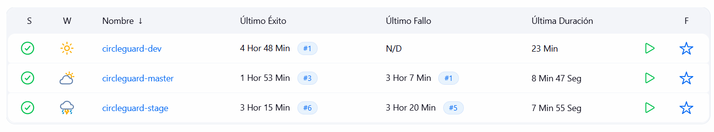


## 3. Pipelines por ambiente (Actividades 2, 4 y 5)

Los tres pipelines comparten el cuerpo común (checkout, pruebas unitarias, pruebas de integración, build, despliegue al namespace correspondiente y verificación del rollout) y se diferencian en las capas de validación que añaden encima. La filosofía es que `dev` es un ciclo rápido para el desarrollador, `stage` es un ensayo del flujo de producción con carga moderada y `master` es la puerta final con carga de producción y release notes automatizados. Esta progresión es la razón por la que `stage` y `master` comparten la mayoría de stages: stage existe para detectar en un entorno seguro lo que se rompería en producción.

Los tres pipelines aceptan el parámetro booleano `SKIP_DOCKER_BUILD`. Cuando se activa, se omiten la compilación de JARs y la construcción de imágenes Docker, y el deploy reutiliza la etiqueta `*-latest` disponible en el daemon. Es útil cuando se itera sobre stages posteriores al build (deployment, pruebas de sistema o rendimiento) sin querer reconstruir todo el árbol Gradle.

| Stage                   | dev | stage | master |
|-------------------------|:---:|:-----:|:------:|
| Checkout                | si  | si    | si     |
| Unit Tests              | si  | si    | si     |
| Integration Tests       | si  | si    | si     |
| Build JARs              | si  | si    | si     |
| Build Docker Images     | si  | si    | si     |
| Deploy + Wait Rollout   | si  | si    | si     |
| Smoke Tests             | si  |       |        |
| E2E Tests               |     | si    | si     |
| Performance (Locust)    |     | si (10 usuarios / 60 s) | si (50 usuarios / 120 s) |
| Generate Release Notes  |     |       | si     |

El esquema de etiquetado de imágenes refleja la intención de cada ambiente: `dev-<BUILD>` y `dev-latest` son volátiles y se sobreescriben en cada build; `stage-<BUILD>` deja un rastro de cada validación; y `v<BUILD>` en master es el identificador permanente que aparece en las release notes y en los Deployments de producción.

El uso de `--continue` en los comandos Gradle de pruebas es una decisión deliberada: si un servicio falla sus pruebas unitarias, los demás siguen ejecutándose. La pestaña JUnit del build muestra entonces el panorama completo y no solo el primer servicio en romperse, lo que reduce el ping-pong de builds para diagnosticar fallos múltiples.

### 3.1 Resultados de los pipelines

#### Pipeline dev


#### Pipeline stage

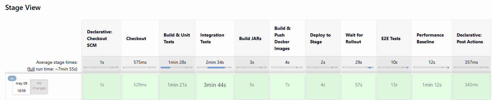

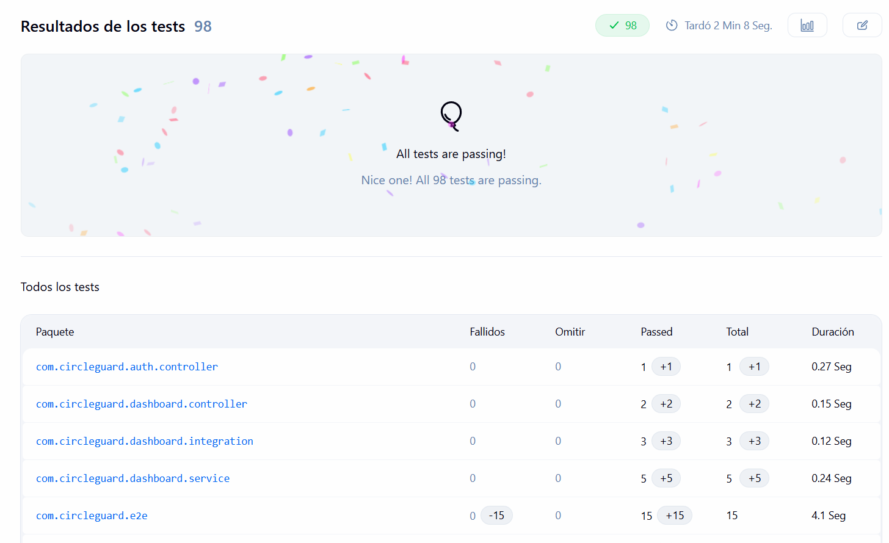

#### Pipeline master

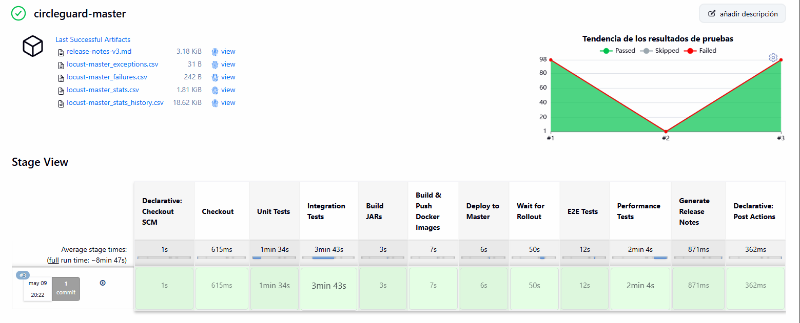


## 4. Pruebas implementadas (Actividad 3 — 30%)

La estrategia de pruebas sigue la pirámide clásica: una base ancha de pruebas unitarias rápidas con mocks, un nivel intermedio de pruebas de integración con infraestructura embebida (Testcontainers, Kafka embebido, H2), y una cima de pruebas E2E y de rendimiento contra el sistema desplegado en Kubernetes. La razón de esta forma es operativa: las pruebas unitarias se ejecutan en segundos en cada commit, las de integración en minutos antes de cada despliegue, y las E2E y de rendimiento solo después del despliegue porque dependen de él.

| Tipo            | Identificador | Cantidad nueva | Nivel de aislamiento |
|-----------------|---------------|----------------|----------------------|
| Unitarias       | PU-xxx        | 23             | Mocks (Mockito) |
| Integración     | PI-xxx        | 12             | Spring Boot context con Kafka/Neo4j embebidos y H2 |
| End-to-end      | PE-xxx        | 15             | HTTP real contra servicios desplegados en Kubernetes |
| Rendimiento     | PR-xxx        | 3 escenarios   | Locust contra los servicios desplegados |

Cada caso de prueba está documentado con el formato estandar: identificador único, nombre, descripción, prerrequisitos, entradas, acciones, salida esperada y criterios de aceptación. Esto permite trazabilidad desde el código de la prueba hasta la funcionalidad que valida.


### 4.1 Pruebas unitarias

Las pruebas unitarias verifican el comportamiento de componentes individuales con todas sus dependencias mockeadas con Mockito. La intención es que cada caso valide una decisión de diseño puntual: una invariante del modelo, una condición de borde de un mapper, o el contrato de un servicio frente a una excepción. Los 23 casos se organizan por microservicio y por clase de prueba.


#### circleguard-form-service

##### `HealthSurveyServiceTest`

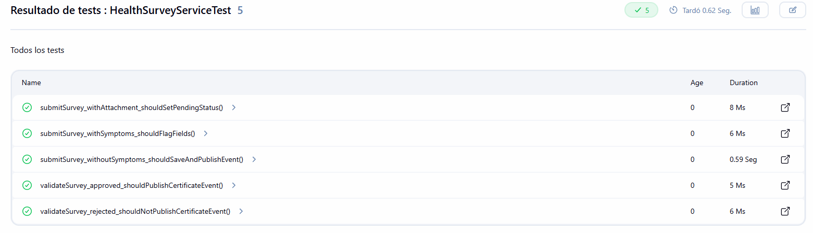


| Campo | Descripción |
|---|---|
| **Identificador Único** | PU-001 |
| **Nombre** | Envío de encuesta sin síntomas publica evento Kafka correcto |
| **Descripción** | Verifica que al enviar una encuesta sin síntomas el servicio guarda la entidad, asigna `hasFever=false` y `hasCough=false`, y publica el evento `survey.submitted` en Kafka con el `anonymousId` como clave y `hasSymptoms=false` en el payload. |
| **Prerrequisitos/Condiciones** | `HealthSurveyRepository`, `QuestionnaireService`, `SymptomMapper` y `KafkaTemplate` mockeados; `SymptomMapper` configurado para retornar `false`. |
| **Entradas** | Objeto `HealthSurvey` con `anonymousId` válido y sin campos de síntomas explícitos. |
| **Acciones** | Se invoca `HealthSurveyService.submitSurvey()` con la encuesta de entrada. |
| **Salida Esperada** | La encuesta retornada tiene un `id` no nulo, `hasFever=false` y `hasCough=false`; `KafkaTemplate.send()` es invocado exactamente una vez con el topic `survey.submitted`. |
| **Criterios de Aceptación** | El test pasa sin excepciones; la verificación de Mockito sobre `kafkaTemplate.send` no genera fallo. |


| Campo | Descripción |
|---|---|
| **Identificador Único** | PU-002 |
| **Nombre** | Envío de encuesta con síntomas activa indicadores clínicos |
| **Descripción** | Verifica que cuando el `SymptomMapper` detecta síntomas, el servicio asigna `hasFever=true` y `hasCough=true` en la encuesta antes de persistirla. |
| **Prerrequisitos/Condiciones** | `SymptomMapper` mockeado para retornar `true`; repositorio configurado para retornar la entidad guardada. |
| **Entradas** | Objeto `HealthSurvey` con `anonymousId` válido y sin campos de síntomas. |
| **Acciones** | Se invoca `HealthSurveyService.submitSurvey()`. |
| **Salida Esperada** | La encuesta retornada tiene `hasFever=true` y `hasCough=true`. |
| **Criterios de Aceptación** | Ambos campos booleanos son `true` en la entidad retornada; no se lanza ninguna excepción. |


| Campo | Descripción |
|---|---|
| **Identificador Único** | PU-003 |
| **Nombre** | Encuesta con adjunto se crea en estado PENDING |
| **Descripción** | Verifica que cuando la encuesta incluye un `attachmentPath` no nulo, el servicio asigna automáticamente `ValidationStatus.PENDING` antes de persistir. |
| **Prerrequisitos/Condiciones** | No se requiere cuestionario activo; repositorio mockeado para retornar la entidad tal como se recibe. |
| **Entradas** | Objeto `HealthSurvey` con `attachmentPath="/uploads/evidence.pdf"`. |
| **Acciones** | Se invoca `HealthSurveyService.submitSurvey()`; se captura el argumento pasado al repositorio con `ArgumentCaptor`. |
| **Salida Esperada** | El argumento capturado tiene `validationStatus=PENDING`. |
| **Criterios de Aceptación** | El `ArgumentCaptor` confirma que el estado fue asignado antes de persistir; no se lanza excepción. |


| Campo | Descripción |
|---|---|
| **Identificador Único** | PU-004 |
| **Nombre** | Validación APPROVED publica evento certificate.validated |
| **Descripción** | Verifica que cuando un administrador aprueba una encuesta con certificado, el servicio publica el evento `certificate.validated` en Kafka con el `adminId` y `status=APPROVED` en el payload. |
| **Prerrequisitos/Condiciones** | Existe en el repositorio una encuesta en estado `PENDING` con `anonymousId` conocido. |
| **Entradas** | `surveyId` válido, `ValidationStatus.APPROVED`, `adminId` de un usuario administrador. |
| **Acciones** | Se invoca `HealthSurveyService.validateSurvey()` con los parámetros de entrada. |
| **Salida Esperada** | `KafkaTemplate.send()` es invocado con el topic `certificate.validated` y el payload contiene `adminId` y `status="APPROVED"`. |
| **Criterios de Aceptación** | La verificación de Mockito confirma que el evento fue publicado exactamente una vez con los datos correctos. |


| Campo | Descripción |
|---|---|
| **Identificador Único** | PU-005 |
| **Nombre** | Validación REJECTED no publica evento certificate.validated |
| **Descripción** | Verifica que cuando un administrador rechaza una encuesta, el servicio NO publica el evento `certificate.validated`, ya que solo las aprobaciones deben restaurar el acceso del usuario. |
| **Prerrequisitos/Condiciones** | Existe en el repositorio una encuesta en estado `PENDING`. |
| **Entradas** | `surveyId` válido, `ValidationStatus.REJECTED`, `adminId`. |
| **Acciones** | Se invoca `HealthSurveyService.validateSurvey()`. |
| **Salida Esperada** | `KafkaTemplate.send()` con el topic `certificate.validated` nunca es invocado. |
| **Criterios de Aceptación** | La verificación `verify(kafkaTemplate, never())` pasa sin error; el estado de la encuesta es actualizado a `REJECTED`. |


##### `SymptomMapperEdgeCasesTest`

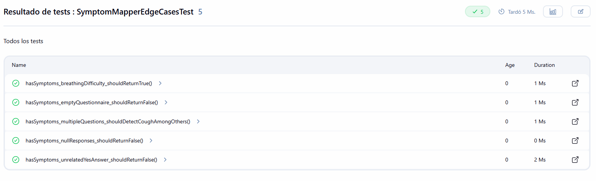


| Campo | Descripción |
|---|---|
| **Identificador Único** | PU-006 |
| **Nombre** | Respuestas nulas retornan falso en detección de síntomas |
| **Descripción** | Verifica que `SymptomMapper.hasSymptoms()` retorna `false` sin lanzar excepción cuando el mapa de respuestas del estudiante es `null`. |
| **Prerrequisitos/Condiciones** | Instancia de `SymptomMapper` creada directamente sin Spring (prueba POJO). |
| **Entradas** | `HealthSurvey` con `responses=null`; `Questionnaire` con lista de preguntas vacía. |
| **Acciones** | Se invoca `mapper.hasSymptoms(survey, questionnaire)`. |
| **Salida Esperada** | Retorna `false`. |
| **Criterios de Aceptación** | No se lanza `NullPointerException`; el valor retornado es `false`. |


| Campo | Descripción |
|---|---|
| **Identificador Único** | PU-007 |
| **Nombre** | Dificultad respiratoria es detectada como síntoma |
| **Descripción** | Verifica que una respuesta afirmativa a una pregunta cuyo texto contiene la palabra "breathing" activa la detección de síntomas, pues el mapper reconoce dicho término como indicador clínico. |
| **Prerrequisitos/Condiciones** | Cuestionario con una pregunta de tipo `YES_NO` cuyo texto es "Do you have difficulty breathing?". |
| **Entradas** | Respuesta `YES` a la pregunta de dificultad respiratoria. |
| **Acciones** | Se invoca `mapper.hasSymptoms(survey, questionnaire)`. |
| **Salida Esperada** | Retorna `true`. |
| **Criterios de Aceptación** | El valor booleano retornado es `true`; no se lanza excepción. |


| Campo | Descripción |
|---|---|
| **Identificador Único** | PU-008 |
| **Nombre** | Respuesta afirmativa en pregunta no clínica no activa síntomas |
| **Descripción** | Verifica que responder "YES" a una pregunta cuyo texto no contiene términos clínicos reconocidos (fever, cough, breathing) no activa la detección de síntomas. |
| **Prerrequisitos/Condiciones** | Cuestionario con una pregunta de tipo `YES_NO` cuyo texto es "Have you been vaccinated?". |
| **Entradas** | Respuesta `YES` a la pregunta de vacunación. |
| **Acciones** | Se invoca `mapper.hasSymptoms(survey, questionnaire)`. |
| **Salida Esperada** | Retorna `false`. |
| **Criterios de Aceptación** | El valor booleano retornado es `false`; el mapper no confunde preguntas epidemiológicas irrelevantes con síntomas. |


| Campo | Descripción |
|---|---|
| **Identificador Único** | PU-009 |
| **Nombre** | Cuestionario con lista de preguntas vacía retorna falso |
| **Descripción** | Verifica que cuando el cuestionario activo no contiene preguntas, el mapper retorna `false` sin importar el contenido del mapa de respuestas. |
| **Prerrequisitos/Condiciones** | Cuestionario con `questions=emptyList()`; encuesta con alguna respuesta arbitraria. |
| **Entradas** | `HealthSurvey` con respuestas presentes; `Questionnaire` con preguntas vacías. |
| **Acciones** | Se invoca `mapper.hasSymptoms(survey, questionnaire)`. |
| **Salida Esperada** | Retorna `false`. |
| **Criterios de Aceptación** | No se lanza excepción; retorna `false`. |


| Campo | Descripción |
|---|---|
| **Identificador Único** | PU-010 |
| **Nombre** | Detección de tos entre múltiples preguntas mixtas |
| **Descripción** | Verifica que cuando un cuestionario contiene preguntas clínicas y no clínicas mezcladas, el mapper detecta correctamente el síntoma de tos aunque otras preguntas no estén relacionadas con síntomas. |
| **Prerrequisitos/Condiciones** | Cuestionario con dos preguntas: "Have you traveled recently?" y "Do you have a cough?". |
| **Entradas** | Respuesta `YES` a ambas preguntas. |
| **Acciones** | Se invoca `mapper.hasSymptoms(survey, questionnaire)`. |
| **Salida Esperada** | Retorna `true` porque al menos una pregunta con "cough" tiene respuesta afirmativa. |
| **Criterios de Aceptación** | El valor retornado es `true`; el mapper identifica correctamente el término clínico. |


#### circleguard-identity-service

##### `IdentityVaultServiceTest`

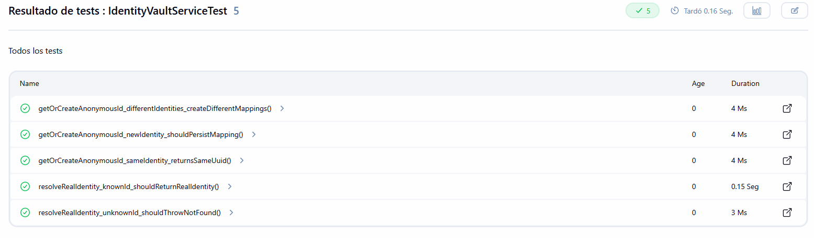

| Campo | Descripción |
|---|---|
| **Identificador Único** | PU-011 |
| **Nombre** | Misma identidad real siempre retorna el mismo UUID anónimo |
| **Descripción** | Verifica la propiedad de idempotencia del servicio de bóveda de identidades: dos invocaciones con la misma identidad real deben retornar exactamente el mismo `anonymousId`. Esta propiedad es fundamental para la privacidad diferencial del sistema. |
| **Prerrequisitos/Condiciones** | El repositorio retorna un `IdentityMapping` existente al consultar por hash; `hashSalt` configurado vía `ReflectionTestUtils`. |
| **Entradas** | Cadena `"student@university.edu"` enviada dos veces. |
| **Acciones** | Se invoca `getOrCreateAnonymousId()` dos veces con el mismo argumento; se comparan los resultados. |
| **Salida Esperada** | Ambas invocaciones retornan el mismo `UUID`; el repositorio nunca invoca `save()`. |
| **Criterios de Aceptación** | `assertEquals(result1, result2)`; `verify(repository, never()).save(any())`. |


| Campo | Descripción |
|---|---|
| **Identificador Único** | PU-012 |
| **Nombre** | Nueva identidad se persiste con UUID y salt generados |
| **Descripción** | Verifica que cuando una identidad no existe en el repositorio, el servicio crea un nuevo `IdentityMapping` con `realIdentity`, `identityHash` y un `salt` generado aleatoriamente, y lo persiste llamando a `repository.save()`. |
| **Prerrequisitos/Condiciones** | El repositorio retorna `Optional.empty()` al consultar por hash; `save()` configurado para asignar un UUID al mapping. |
| **Entradas** | Cadena `"new.student@university.edu"` no registrada previamente. |
| **Acciones** | Se invoca `getOrCreateAnonymousId()`; se captura el argumento de `save()` con `ArgumentCaptor`. |
| **Salida Esperada** | El `ArgumentCaptor` confirma que `realIdentity` coincide con la entrada y que `salt` no es nulo. |
| **Criterios de Aceptación** | `verify(repository).save(captor)` pasa; el UUID retornado coincide con el asignado por el mock del repositorio. |


| Campo | Descripción |
|---|---|
| **Identificador Único** | PU-013 |
| **Nombre** | Identidades distintas producen UUIDs distintos |
| **Descripción** | Verifica que dos identidades reales diferentes producen identificadores anónimos distintos, lo que garantiza que no hay colisiones en el espacio de identificadores. |
| **Prerrequisitos/Condiciones** | El repositorio retorna `Optional.empty()` para cualquier hash; `save()` genera un UUID aleatorio en cada llamada. |
| **Entradas** | `"alice@uni.edu"` y `"bob@uni.edu"` como dos identidades distintas. |
| **Acciones** | Se invocan dos llamadas a `getOrCreateAnonymousId()` con cada identidad. |
| **Salida Esperada** | Los dos UUIDs retornados son distintos entre sí; `save()` es invocado exactamente dos veces. |
| **Criterios de Aceptación** | `assertNotEquals(id1, id2)`; `verify(repository, times(2)).save(any())`. |


| Campo | Descripción |
|---|---|
| **Identificador Único** | PU-014 |
| **Nombre** | UUID desconocido lanza excepción 404 al resolver identidad |
| **Descripción** | Verifica que cuando se solicita resolver un `anonymousId` que no existe en el repositorio, el servicio lanza `ResponseStatusException` con código HTTP 404, en lugar de retornar un valor nulo. |
| **Prerrequisitos/Condiciones** | El repositorio retorna `Optional.empty()` para el UUID consultado. |
| **Entradas** | Un UUID aleatorio no registrado en el sistema. |
| **Acciones** | Se invoca `resolveRealIdentity()` con el UUID desconocido. |
| **Salida Esperada** | Se lanza `ResponseStatusException` con `HttpStatus.NOT_FOUND`. |
| **Criterios de Aceptación** | `assertThrows(ResponseStatusException.class, ...)` pasa. |


| Campo | Descripción |
|---|---|
| **Identificador Único** | PU-015 |
| **Nombre** | UUID conocido resuelve correctamente la identidad real |
| **Descripción** | Verifica que cuando se solicita resolver un `anonymousId` registrado, el servicio retorna la cadena de identidad real original almacenada en el `IdentityMapping`. |
| **Prerrequisitos/Condiciones** | El repositorio retorna un `IdentityMapping` con `realIdentity="known.student@university.edu"`. |
| **Entradas** | El UUID anónimo asociado a la identidad registrada. |
| **Acciones** | Se invoca `resolveRealIdentity()` con el UUID. |
| **Salida Esperada** | Retorna `"known.student@university.edu"`. |
| **Criterios de Aceptación** | `assertEquals("known.student@university.edu", result)`. |


#### circleguard-promotion-service

##### `StatusLifecycleServiceTest`

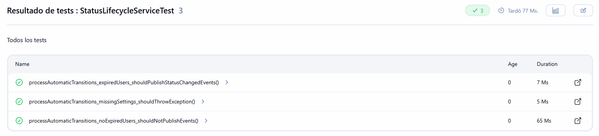

| Campo | Descripción |
|---|---|
| **Identificador Único** | PU-016 |
| **Nombre** | Transición automática sin usuarios expirados no publica eventos |
| **Descripción** | Verifica que cuando la consulta Cypher de usuarios en estado SUSPECT/PROBABLE con ventana expirada no retorna resultados, el servicio no publica ningún evento Kafka y no actualiza Redis. |
| **Prerrequisitos/Condiciones** | `SystemSettings` con `mandatoryFenceDays=14`; Neo4j mockeado para retornar lista vacía de IDs liberados. |
| **Entradas** | Ninguna entrada explícita; el método es invocado por el scheduler. |
| **Acciones** | Se invoca `processAutomaticTransitions()` directamente. |
| **Salida Esperada** | `KafkaTemplate.send()` nunca es invocado; `redisTemplate.opsForValue().multiSet()` nunca es invocado. |
| **Criterios de Aceptación** | `verify(kafkaTemplate, never()).send(...)` pasa. |


| Campo | Descripción |
|---|---|
| **Identificador Único** | PU-017 |
| **Nombre** | Usuarios con ventana expirada son liberados y notificados por Kafka |
| **Descripción** | Verifica que cuando existen usuarios cuyo estado de riesgo ha superado el período de cuarentena obligatoria, el servicio publica un evento `promotion.status.changed` por cada usuario liberado y actualiza Redis en lote. |
| **Prerrequisitos/Condiciones** | Neo4j mockeado para retornar dos IDs `["user-001", "user-002"]` como usuarios liberados; Redis y Kafka mockeados. |
| **Entradas** | Ninguna entrada explícita; el método es invocado directamente en el test. |
| **Acciones** | Se invoca `processAutomaticTransitions()`; se verifican las interacciones con Kafka y Redis. |
| **Salida Esperada** | `KafkaTemplate.send()` es invocado exactamente dos veces con el topic `promotion.status.changed`. |
| **Criterios de Aceptación** | `verify(kafkaTemplate, times(2)).send(eq("promotion.status.changed"), ...)` pasa. |


| Campo | Descripción |
|---|---|
| **Identificador Único** | PU-018 |
| **Nombre** | Ausencia de SystemSettings lanza IllegalStateException |
| **Descripción** | Verifica que cuando el repositorio de configuración del sistema no retorna ninguna entrada, el método lanza `IllegalStateException` en lugar de operar con valores nulos o por defecto silenciosos. |
| **Prerrequisitos/Condiciones** | `SystemSettingsRepository` mockeado para retornar `Optional.empty()`. |
| **Entradas** | Ninguna; el método es invocado sin configuración previa. |
| **Acciones** | Se invoca `processAutomaticTransitions()`; se espera excepción. |
| **Salida Esperada** | Se lanza `IllegalStateException`. |
| **Criterios de Aceptación** | `assertThrows(IllegalStateException.class, ...)` pasa. |


#### circleguard-dashboard-service

##### `AnalyticsServiceTest`

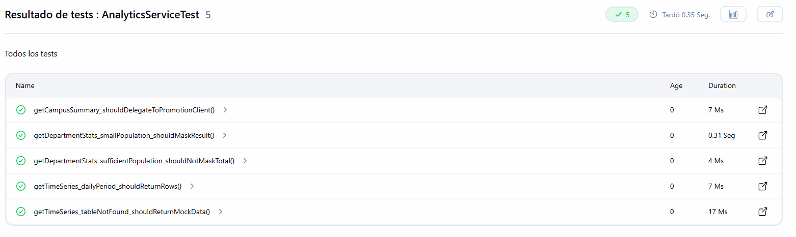

| Campo | Descripción |
|---|---|
| **Identificador Único** | PU-019 |
| **Nombre** | Resumen campus delega correctamente al PromotionClient |
| **Descripción** | Verifica que `AnalyticsService.getCampusSummary()` delega la consulta al `PromotionClient` y retorna exactamente el mapa recibido, sin modificar sus valores. |
| **Prerrequisitos/Condiciones** | `PromotionClient` mockeado para retornar un mapa con `totalUsers=500` y `confirmedCount=3`. |
| **Entradas** | Ninguna entrada explícita; consulta sin parámetros. |
| **Acciones** | Se invoca `getCampusSummary()`; se verifica el resultado y la interacción con el client. |
| **Salida Esperada** | El mapa retornado es igual al retornado por el mock; `getHealthStats()` es invocado exactamente una vez. |
| **Criterios de Aceptación** | `assertEquals(expected, result)`; `verify(promotionClient).getHealthStats()`. |


| Campo | Descripción |
|---|---|
| **Identificador Único** | PU-020 |
| **Nombre** | Departamento con población pequeña activa enmascaramiento K-Anonymity |
| **Descripción** | Verifica que cuando el `PromotionClient` retorna estadísticas de un departamento con menos de cinco usuarios (`totalUsers=2`), el servicio aplica el filtro K-Anonymity que reemplaza el valor por `"<5"` y agrega una nota de privacidad. |
| **Prerrequisitos/Condiciones** | `PromotionClient` mockeado para retornar `{totalUsers: 2, department: "Mathematics"}`. |
| **Entradas** | Nombre de departamento `"Mathematics"`. |
| **Acciones** | Se invoca `getDepartmentStats("Mathematics")`; se inspeccionan los campos del mapa retornado. |
| **Salida Esperada** | El campo `totalUsers` en el resultado es `"<5"`; el mapa contiene la clave `"note"`. |
| **Criterios de Aceptación** | `assertEquals("<5", result.get("totalUsers"))`; `assertTrue(result.containsKey("note"))`. |


| Campo | Descripción |
|---|---|
| **Identificador Único** | PU-021 |
| **Nombre** | Departamento con población suficiente no es enmascarado |
| **Descripción** | Verifica que cuando la población del departamento es igual o superior al umbral K (cinco usuarios), el filtro de privacidad no modifica el campo `totalUsers` ni agrega notas de enmascaramiento. |
| **Prerrequisitos/Condiciones** | `PromotionClient` mockeado para retornar `{totalUsers: 100, confirmedCount: 2}`. |
| **Entradas** | Nombre de departamento `"Engineering"`. |
| **Acciones** | Se invoca `getDepartmentStats("Engineering")`; se inspeccionan los campos del resultado. |
| **Salida Esperada** | `totalUsers` retorna el valor numérico original `100`; no existe la clave `"note"`. |
| **Criterios de Aceptación** | `assertEquals(100, result.get("totalUsers"))`; `assertFalse(result.containsKey("note"))`. |


| Campo | Descripción |
|---|---|
| **Identificador Único** | PU-022 |
| **Nombre** | Tabla de series de tiempo inexistente retorna datos mock |
| **Descripción** | Verifica que cuando la consulta SQL a la tabla `status_events` falla porque la tabla no existe (ambiente nuevo o de prueba), el servicio retorna una lista de datos mock generados internamente en lugar de propagar la excepción. |
| **Prerrequisitos/Condiciones** | `JdbcTemplate` mockeado para lanzar `RuntimeException("Table not found")`. |
| **Entradas** | Parámetros `period="hourly"` y `limit=5`. |
| **Acciones** | Se invoca `getTimeSeries("hourly", 5)`; se inspecciona el resultado. |
| **Salida Esperada** | La lista retornada no está vacía; cada elemento contiene las claves `"status"` y `"total"`. |
| **Criterios de Aceptación** | `assertFalse(result.isEmpty())`; cada elemento del stream contiene las claves esperadas. |


| Campo | Descripción |
|---|---|
| **Identificador Único** | PU-023 |
| **Nombre** | Período diario consulta con truncación por día |
| **Descripción** | Verifica que cuando se solicita el período `"daily"`, el servicio construye la consulta SQL con truncación por día y retorna los datos del repositorio correctamente. |
| **Prerrequisitos/Condiciones** | `JdbcTemplate` mockeado para retornar una fila cuando la consulta contiene la cadena `"day"`. |
| **Entradas** | Parámetros `period="daily"` y `limit=10`. |
| **Acciones** | Se invoca `getTimeSeries("daily", 10)`; se verifica el argumento de `queryForList`. |
| **Salida Esperada** | La lista no está vacía; el primer elemento contiene `status="ACTIVE"`. |
| **Criterios de Aceptación** | `assertFalse(result.isEmpty())`; el valor de `"status"` en el primer elemento es `"ACTIVE"`. |


### 4.2 Pruebas de integración

Las pruebas de integración verifican que varios componentes funcionan correctamente cuando se conectan entre sí dentro del contexto completo de Spring Boot. A diferencia de las pruebas unitarias, estas cargan el contexto Spring real y se ejecutan contra instancias embebidas de la infraestructura real (Kafka, Neo4j, Redis y PostgreSQL), que corren dentro de la misma JVM del proceso de pruebas. Esto permite validar serialización, consumo desde topics, recorridos de grafo y cacheo en condiciones equivalentes a producción sin requerir Docker ni conectividad de red externa.

Apache Kafka se instancia con `spring-kafka-test` mediante la anotación `@EmbeddedKafka(partitions = 1, topics = {...})`, que arranca un broker Kafka in-process al cual los `KafkaTemplate` y los `@KafkaListener` reales del servicio bajo prueba se conectan automáticamente al sobrescribir `spring.kafka.bootstrap-servers` con `${spring.embedded.kafka.brokers}`. Los tests que publican usan un consumidor adicional creado con `KafkaTestUtils.consumerProps()` para verificar el contenido y la clave del registro emitido; los tests que consumen usan `ContainerTestUtils.waitForAssignment()` para esperar a que el listener se una al grupo antes de publicar, y `Awaitility` para esperar de forma determinista a que las dependencias mockeadas downstream sean invocadas. Neo4j se instancia con `neo4j-harness:5.26.0` en modo in-process mediante `Neo4jBuilders.newInProcessBuilder()`, lo que habilita el protocolo Bolt real y permite ejecutar consultas Cypher completas. Redis se instancia con `jedis-mock:1.1.0`, una implementación Java del protocolo RESP que recibe y responde comandos Redis reales a través de red sin binario nativo. Para la capa JPA/PostgreSQL se utiliza H2 en modo de compatibilidad PostgreSQL, configurado mediante el perfil Spring `test` con DDL automático y Flyway deshabilitado.

Se crearon cinco nuevas clases de prueba de integración con un total de doce casos.


#### circleguard-form-service

##### `SurveyKafkaPublishIntegrationTest`

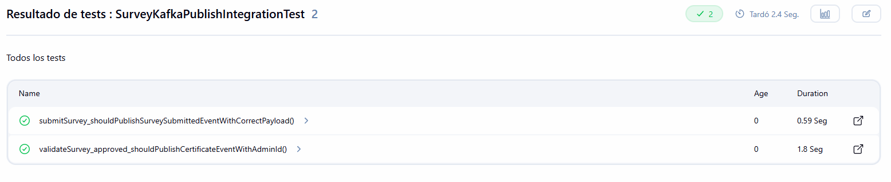


| Campo | Descripción |
|---|---|
| **Identificador Único** | PI-001 |
| **Nombre** | Payload de survey.submitted contiene campos obligatorios |
| **Descripción** | Verifica, con el contexto Spring completo cargado y un broker Kafka embebido (`@EmbeddedKafka`), que al invocar `HealthSurveyService.submitSurvey()` el `KafkaTemplate` real publica un registro en el topic `survey.submitted` cuya clave es el `anonymousId` y cuyo payload contiene los campos `anonymousId`, `hasSymptoms=true` y `timestamp`. |
| **Prerrequisitos/Condiciones** | Contexto Spring cargado con perfil `test`; broker Kafka embebido con el topic creado; repositorio, `QuestionnaireService` y `SymptomMapper` mockeados como `@MockBean`; consumidor de prueba suscrito al topic vía `KafkaTestUtils.consumerProps()`. |
| **Entradas** | `HealthSurvey` con `anonymousId` válido; cuestionario con una pregunta de fiebre; `SymptomMapper` configurado para retornar `true`. |
| **Acciones** | Se invoca `submitSurvey()`; el consumidor del test recupera el registro con `KafkaTestUtils.getSingleRecord(topic, Duration.ofSeconds(10))`. |
| **Salida Esperada** | El registro consumido tiene `key = anonymousId.toString()` y el payload contiene `anonymousId`, `hasSymptoms=true` y `timestamp` no nulo. |
| **Criterios de Aceptación** | El registro llega al topic dentro del timeout y los tres campos del payload coinciden con los esperados. |


| Campo | Descripción |
|---|---|
| **Identificador Único** | PI-002 |
| **Nombre** | Payload de certificate.validated contiene adminId y estado APPROVED |
| **Descripción** | Verifica que al aprobar un certificado, el evento `certificate.validated` publicado en el broker Kafka embebido contiene el `adminId` del aprobador y el campo `status="APPROVED"`, garantizando la trazabilidad de la validación. |
| **Prerrequisitos/Condiciones** | Contexto Spring cargado con broker Kafka embebido y topic `certificate.validated`; encuesta en estado `PENDING` disponible en el repositorio mockeado; consumidor de prueba suscrito al topic. |
| **Entradas** | `surveyId`, `ValidationStatus.APPROVED`, `adminId` del administrador. |
| **Acciones** | Se invoca `validateSurvey()`; el consumidor del test lee el registro emitido al topic. |
| **Salida Esperada** | El payload contiene `status="APPROVED"` y `adminId` coincide con el identificador serializado del administrador. |
| **Criterios de Aceptación** | `KafkaTestUtils.getSingleRecord()` retorna el registro dentro del timeout y ambos campos coinciden. |


#### circleguard-promotion-service

##### `SurveyListenerToServiceIntegrationTest`

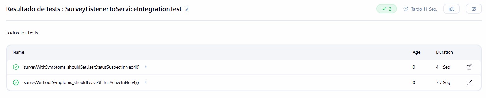


| Campo | Descripción |
|---|---|
| **Identificador Único** | PI-003 |
| **Nombre** | SurveyListener con síntomas invoca actualización a estado SUSPECT |
| **Descripción** | Verifica el flujo Kafka completo en `promotion-service`: un evento publicado al topic `survey.submitted` en el broker embebido es consumido por el `@KafkaListener` real (`SurveyListener`), que delega la actualización de estado al `HealthStatusService` cuando `hasSymptoms=true`. |
| **Prerrequisitos/Condiciones** | Contexto Spring cargado con perfil `test`; broker Kafka embebido con topic `survey.submitted`; `HealthStatusService` mockeado como `@MockBean`; el listener real registrado en el `KafkaListenerEndpointRegistry`; espera a la asignación de partición vía `ContainerTestUtils.waitForAssignment()`. |
| **Entradas** | Mapa de evento con `anonymousId="integration-user-001"` y `hasSymptoms=true` publicado al topic con `KafkaTemplate`. |
| **Acciones** | Se publica el evento al topic; `Awaitility.await()` espera a que el listener consuma y delegue. |
| **Salida Esperada** | `healthStatusService.updateStatus("integration-user-001", "SUSPECT")` es invocado dentro del timeout. |
| **Criterios de Aceptación** | `await().atMost(10s).untilAsserted(verify(...))` completa sin timeout. |


| Campo | Descripción |
|---|---|
| **Identificador Único** | PI-004 |
| **Nombre** | SurveyListener sin síntomas no actualiza estado de salud |
| **Descripción** | Verifica que cuando el evento `survey.submitted` indica `hasSymptoms=false`, el listener consume el mensaje del broker pero no invoca `HealthStatusService`, evitando cambios de estado innecesarios y reduciendo la carga en el grafo Neo4j. |
| **Prerrequisitos/Condiciones** | Contexto Spring cargado; broker Kafka embebido; `HealthStatusService` mockeado; listener registrado y con partición asignada. |
| **Entradas** | Mapa de evento con `anonymousId="integration-user-002"` y `hasSymptoms=false` publicado al topic. |
| **Acciones** | Se publica el evento; tras un `pollDelay` de 3 segundos se verifica que el mock no fue invocado. |
| **Salida Esperada** | `healthStatusService.updateStatus()` nunca es invocado. |
| **Criterios de Aceptación** | `verify(healthStatusService, never()).updateStatus(anyString(), anyString())` pasa después del polling. |


#### circleguard-dashboard-service

##### `DashboardPromotionClientIntegrationTest`

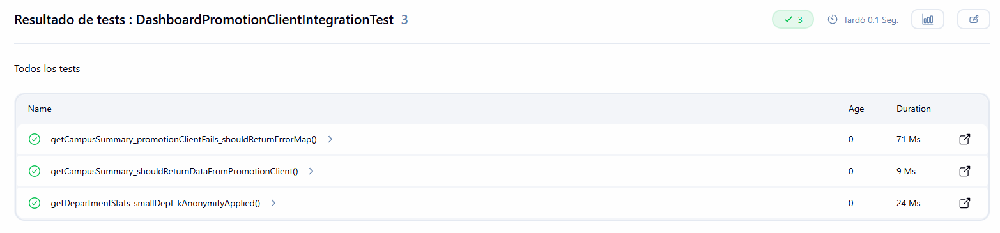


| Campo | Descripción |
|---|---|
| **Identificador Único** | PI-005 |
| **Nombre** | getCampusSummary retorna datos del PromotionClient en contexto Spring |
| **Descripción** | Verifica que con el contexto Spring completo cargado, `AnalyticsService.getCampusSummary()` delega correctamente al `PromotionClient` y retorna la respuesta sin modificación, validando que el bean `PromotionClient` está correctamente inyectado. |
| **Prerrequisitos/Condiciones** | `PromotionClient` mockeado como `@MockBean` en contexto Spring; retorna un mapa con `totalUsers=350`. |
| **Entradas** | Ninguna entrada; consulta sin parámetros. |
| **Acciones** | Se invoca `analyticsService.getCampusSummary()` a través del bean inyectado por Spring. |
| **Salida Esperada** | El resultado tiene `totalUsers=350`; `promotionClient.getHealthStats()` es invocado exactamente una vez. |
| **Criterios de Aceptación** | `assertEquals(350, result.get("totalUsers"))`; `verify(promotionClient, times(1)).getHealthStats()`. |


| Campo | Descripción |
|---|---|
| **Identificador Único** | PI-006 |
| **Nombre** | Departamento con población menor a K es enmascarado en contexto Spring |
| **Descripción** | Verifica que con el contexto Spring completo, la cadena `AnalyticsService` que invoca a `PromotionClient` y luego pasa por `KAnonymityFilter` aplica correctamente el enmascaramiento cuando la población del departamento es inferior al umbral de privacidad. |
| **Prerrequisitos/Condiciones** | `PromotionClient` mockeado para retornar `{totalUsers: 3, department: "Philosophy"}`. |
| **Entradas** | Nombre de departamento `"Philosophy"`. |
| **Acciones** | Se invoca `getDepartmentStats("Philosophy")`. |
| **Salida Esperada** | `totalUsers` es `"<5"` en el resultado; el mapa contiene la clave `"note"`. |
| **Criterios de Aceptación** | `assertEquals("<5", result.get("totalUsers"))`; `assertTrue(result.containsKey("note"))`. |


| Campo | Descripción |
|---|---|
| **Identificador Único** | PI-007 |
| **Nombre** | Fallo del PromotionClient retorna mapa de error sin excepción |
| **Descripción** | Verifica que cuando el `PromotionClient` retorna un mapa con la clave `"error"` (comportamiento de fallback ante fallo HTTP), el `AnalyticsService` no lanza excepción y retorna el mapa de error al cliente del dashboard. |
| **Prerrequisitos/Condiciones** | `PromotionClient` mockeado para retornar `{error: "Service unavailable"}`. |
| **Entradas** | Ninguna entrada; consulta sin parámetros. |
| **Acciones** | Se invoca `getCampusSummary()`; se inspecciona el resultado. |
| **Salida Esperada** | El resultado no es nulo y contiene la clave `"error"`. |
| **Criterios de Aceptación** | `assertTrue(result.containsKey("error"))`; no se lanza ninguna excepción. |


#### circleguard-notification-service

##### `StatusChangeNotificationIntegrationTest`

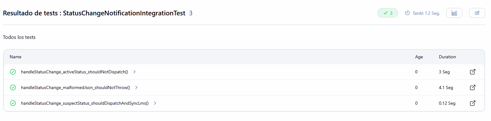

| Campo | Descripción |
|---|---|
| **Identificador Único** | PI-008 |
| **Nombre** | Evento de estado SUSPECT despacha notificación y sincroniza LMS |
| **Descripción** | Verifica que un evento JSON con `status=SUSPECT` publicado en el broker Kafka embebido al topic `promotion.status.changed` es consumido por el `ExposureNotificationListener` real, que delega tanto al `NotificationDispatcher` como al `LmsService`, integrando en un único test el flujo completo desde Kafka hasta el listener y sus dependencias downstream. |
| **Prerrequisitos/Condiciones** | Contexto Spring cargado; broker Kafka embebido con el topic `promotion.status.changed`; `NotificationDispatcher`, `LmsService`, servicios de email/sms/push mockeados como `@MockBean`; espera a la asignación de partición. |
| **Entradas** | Cadena JSON `{"anonymousId":"user-int-001","status":"SUSPECT","timestamp":1234567890}` publicada al topic con `KafkaTemplate<String,String>`. |
| **Acciones** | Se publica el mensaje; `Awaitility` espera a que ambas dependencias mockeadas sean invocadas. |
| **Salida Esperada** | `dispatcher.dispatch("user-int-001", "SUSPECT")` invocado una vez; `lmsService.syncRemoteAttendance("user-int-001", "SUSPECT")` invocado una vez. |
| **Criterios de Aceptación** | `await().atMost(10s).untilAsserted(...)` completa sin timeout y ambas verificaciones de Mockito pasan. |


| Campo | Descripción |
|---|---|
| **Identificador Único** | PI-009 |
| **Nombre** | Evento de estado ACTIVE no genera notificaciones |
| **Descripción** | Verifica que el estado `ACTIVE`, que es el estado normal del sistema, no genera notificaciones ni sincronizaciones con el LMS, evitando ruido en los canales de comunicación. El mensaje se publica al broker embebido y el listener lo consume; la lógica del listener no debe disparar las dependencias downstream. |
| **Prerrequisitos/Condiciones** | Contexto Spring cargado; broker Kafka embebido; `NotificationDispatcher` y `LmsService` mockeados; listener con partición asignada. |
| **Entradas** | Cadena JSON `{"anonymousId":"user-int-002","status":"ACTIVE","timestamp":1234567890}` publicada al topic. |
| **Acciones** | Se publica el mensaje; tras un `pollDelay` de 3 segundos se verifican los mocks. |
| **Salida Esperada** | `dispatcher.dispatch()` nunca es invocado; `lmsService.syncRemoteAttendance()` nunca es invocado. |
| **Criterios de Aceptación** | Ambas verificaciones `verify(..., never())` pasan después del polling. |


| Campo | Descripción |
|---|---|
| **Identificador Único** | PI-010 |
| **Nombre** | JSON malformado no lanza excepción ni despacha notificación |
| **Descripción** | Verifica la resiliencia del consumidor Kafka ante mensajes corruptos: cuando el listener consume un mensaje del broker embebido cuyo contenido no es JSON válido, lo maneja silenciosamente (try/catch interno) sin propagar la excepción, garantizando que el pod no falla y el consumer group no queda bloqueado. |
| **Prerrequisitos/Condiciones** | Contexto Spring cargado; broker Kafka embebido; `NotificationDispatcher` mockeado; listener con partición asignada. |
| **Entradas** | Cadena malformada `"THIS IS NOT JSON {{{}}}"` publicada al topic con `KafkaTemplate<String,String>`. |
| **Acciones** | Se publica el mensaje al topic; tras un `pollDelay` se verifica que el dispatcher no fue invocado y que el consumer no quedó atascado. |
| **Salida Esperada** | El listener no propaga excepción y `dispatcher.dispatch()` nunca es invocado. |
| **Criterios de Aceptación** | El test no falla por excepción y `verify(dispatcher, never()).dispatch(...)` pasa después del polling. |


#### circleguard-identity-service

##### `IdentityMappingIntegrationTest`

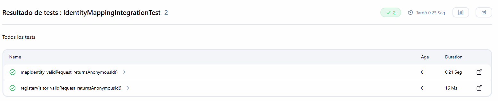


| Campo | Descripción |
|---|---|
| **Identificador Único** | PI-011 |
| **Nombre** | POST /identities/map retorna anonymousId UUID válido |
| **Descripción** | Verifica la capa HTTP completa del `IdentityVaultController` mediante `MockMvc`: que una petición `POST` al endpoint de mapeo con un cuerpo JSON válido recibe una respuesta 200 con el campo `anonymousId` en el body. |
| **Prerrequisitos/Condiciones** | Contexto Spring cargado con `@WebMvcTest`; `IdentityVaultService` y `KafkaTemplate` mockeados; usuario autenticado con `@WithMockUser`. |
| **Entradas** | Body JSON `{"realIdentity":"student@university.edu"}`; token CSRF incluido. |
| **Acciones** | Se realiza `mockMvc.perform(post("/api/v1/identities/map"))` con el body. |
| **Salida Esperada** | Estado HTTP 200; el JSON de respuesta contiene el campo `anonymousId`. |
| **Criterios de Aceptación** | `status().isOk()` y `jsonPath("$.anonymousId").exists()` pasan. |


| Campo | Descripción |
|---|---|
| **Identificador Único** | PI-012 |
| **Nombre** | POST /identities/visitor crea mapping compuesto con prefijo VISITOR |
| **Descripción** | Verifica que el endpoint de registro de visitantes construye el identificador compuesto con el prefijo `VISITOR|` concatenando email, nombre y motivo de visita, antes de delegar al servicio de bóveda. Esta construcción garantiza que los visitantes externos no colisionen con el espacio de identidades de estudiantes y docentes. |
| **Prerrequisitos/Condiciones** | Mismo contexto que PI-011; `vaultService` configurado para retornar un UUID al recibir cualquier cadena. |
| **Entradas** | Body JSON con `name`, `email` y `reason_for_visit`; token CSRF. |
| **Acciones** | Se realiza `mockMvc.perform(post("/api/v1/identities/visitor"))`. |
| **Salida Esperada** | Estado HTTP 200; `vaultService.getOrCreateAnonymousId()` es invocado con un argumento que comienza con `"VISITOR|"` y contiene el email del visitante. |
| **Criterios de Aceptación** | `status().isOk()` pasa; `verify(vaultService).getOrCreateAnonymousId(argThat(id -> id.startsWith("VISITOR|") && id.contains("visitor@external.com")))` pasa. |


### 4.3 Pruebas E2E

Las pruebas end-to-end validan flujos completos de usuario contra los servicios realmente desplegados, sin mocks de ningún tipo. Están implementadas con la librería RestAssured y organizadas en un módulo Gradle independiente en `tests/e2e/`, de modo que puedan ejecutarse de forma aislada contra cualquier ambiente especificando las URLs y puertos mediante propiedades del sistema. El diseño contempla que los servicios pueden no estar disponibles en todos los ambientes, por lo que cada prueba acepta el código HTTP 503 como respuesta válida sin fallar, pero verifica las propiedades funcionales cuando el servicio sí responde con 200.


#### circleguard-form-service

##### `HealthSurveyFlowE2ETest`

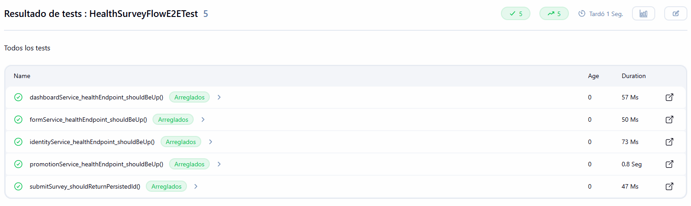


| Campo | Descripción |
|---|---|
| **Identificador Único** | PE-001 |
| **Nombre** | identity-service responde UP en el endpoint de salud |
| **Descripción** | Verifica que el `identity-service` desplegado en Kubernetes responde al endpoint `/actuator/health` con estado HTTP 200 y body `{"status":"UP"}`, confirmando que el pod está en estado operativo. |
| **Prerrequisitos/Condiciones** | `identity-service` desplegado y con `readinessProbe` completada en el namespace objetivo. |
| **Entradas** | Petición GET a `/actuator/health` en el host y puerto configurados por propiedades de sistema. |
| **Acciones** | Se realiza la petición HTTP; se valida el código de estado y el body. |
| **Salida Esperada** | HTTP 200; body contiene `status: "UP"`. |
| **Criterios de Aceptación** | `statusCode(200)` y `body("status", equalTo("UP"))` pasan con RestAssured. |


| Campo | Descripción |
|---|---|
| **Identificador Único** | PE-002 |
| **Nombre** | form-service responde UP en el endpoint de salud |
| **Descripción** | Verifica que el `form-service` desplegado responde correctamente al health check de Spring Actuator, garantizando que las conexiones a PostgreSQL y Kafka están establecidas. |
| **Prerrequisitos/Condiciones** | `form-service` desplegado con acceso a PostgreSQL y Kafka. |
| **Entradas** | Petición GET a `/actuator/health`. |
| **Acciones** | Se realiza la petición HTTP y se validan estado y body. |
| **Salida Esperada** | HTTP 200; body `{"status":"UP"}`. |
| **Criterios de Aceptación** | `statusCode(200)` y `body("status", equalTo("UP"))` pasan. |


| Campo | Descripción |
|---|---|
| **Identificador Único** | PE-003 |
| **Nombre** | Envío de encuesta retorna identificador persistido |
| **Descripción** | Verifica el flujo completo de envío de encuesta: que el endpoint `POST /api/v1/surveys` recibe la petición, persiste la entidad en PostgreSQL y retorna la encuesta con un `id` asignado en la respuesta JSON. |
| **Prerrequisitos/Condiciones** | `form-service` en estado UP con acceso a PostgreSQL. |
| **Entradas** | Body JSON con `anonymousId`, `hasFever=true`, `hasCough=true` y `responses={}`. |
| **Acciones** | Se realiza `POST /api/v1/surveys`; se inspecciona la respuesta. |
| **Salida Esperada** | HTTP 200; el body contiene el campo `id` con un UUID no nulo. |
| **Criterios de Aceptación** | `statusCode == 200 || statusCode == 503`; si 200, `assertNotNull(response.jsonPath().getString("id"))`. |


| Campo | Descripción |
|---|---|
| **Identificador Único** | PE-004 |
| **Nombre** | promotion-service responde UP en el endpoint de salud |
| **Descripción** | Verifica que el `promotion-service` responde correctamente al health check, confirmando que las conexiones a PostgreSQL, Neo4j, Redis y Kafka están activas. Este servicio tiene mayor tiempo de inicialización debido a la conexión con Neo4j. |
| **Prerrequisitos/Condiciones** | `promotion-service` desplegado con `initialDelaySeconds=45` en `readinessProbe` completada. |
| **Entradas** | Petición GET a `/actuator/health`. |
| **Acciones** | Se realiza la petición HTTP y se validan estado y body. |
| **Salida Esperada** | HTTP 200; body `{"status":"UP"}`. |
| **Criterios de Aceptación** | `statusCode(200)` y `body("status", equalTo("UP"))` pasan. |


| Campo | Descripción |
|---|---|
| **Identificador Único** | PE-005 |
| **Nombre** | dashboard-service responde UP en el endpoint de salud |
| **Descripción** | Verifica que el `dashboard-service` responde al health check con estado UP, confirmando su conectividad con PostgreSQL y su capacidad de alcanzar al `promotion-service`. |
| **Prerrequisitos/Condiciones** | `dashboard-service` desplegado con variable de entorno `PROMOTION_API_URL` configurada. |
| **Entradas** | Petición GET a `/actuator/health`. |
| **Acciones** | Se realiza la petición HTTP y se validan estado y body. |
| **Salida Esperada** | HTTP 200; body `{"status":"UP"}`. |
| **Criterios de Aceptación** | `statusCode(200)` y `body("status", equalTo("UP"))` pasan. |


#### circleguard-identity-service

##### `IdentityMappingFlowE2ETest`

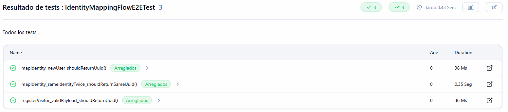


| Campo | Descripción |
|---|---|
| **Identificador Único** | PE-006 |
| **Nombre** | Mapeo de nueva identidad retorna UUID válido |
| **Descripción** | Verifica el flujo completo de mapeo de identidad: que el endpoint `POST /api/v1/identities/map` recibe una nueva identidad, la persiste y retorna un `anonymousId` en formato UUID estándar. |
| **Prerrequisitos/Condiciones** | `identity-service` en estado UP con acceso a PostgreSQL. |
| **Entradas** | Body JSON con `realIdentity` único generado aleatoriamente por UUID. |
| **Acciones** | Se realiza `POST /api/v1/identities/map`; se parsea el `anonymousId` retornado como UUID. |
| **Salida Esperada** | HTTP 200; el campo `anonymousId` en el body es un UUID válido (no lanza `IllegalArgumentException` al parsearse). |
| **Criterios de Aceptación** | `assertDoesNotThrow(() -> UUID.fromString(anonymousId))`; `assertNotNull(anonymousId)`. |


| Campo | Descripción |
|---|---|
| **Identificador Único** | PE-007 |
| **Nombre** | Misma identidad enviada dos veces retorna el mismo UUID |
| **Descripción** | Verifica la propiedad de idempotencia del sistema de extremo a extremo: que dos peticiones HTTP independientes con la misma identidad real retornan el mismo `anonymousId`, lo que garantiza la consistencia del grafo de contactos en Neo4j. |
| **Prerrequisitos/Condiciones** | `identity-service` en estado UP con PostgreSQL disponible. |
| **Entradas** | Body JSON con el mismo `realIdentity` en ambas peticiones. |
| **Acciones** | Se realizan dos peticiones `POST` independientes; se comparan los `anonymousId` retornados. |
| **Salida Esperada** | Ambas peticiones retornan HTTP 200 con el mismo valor de `anonymousId`. |
| **Criterios de Aceptación** | `assertEquals(first.jsonPath().getString("anonymousId"), second.jsonPath().getString("anonymousId"))`. |


| Campo | Descripción |
|---|---|
| **Identificador Único** | PE-008 |
| **Nombre** | Registro de visitante retorna UUID sin exponer identidad real |
| **Descripción** | Verifica que el endpoint de visitantes externos acepta los datos del visitante, crea un `anonymousId` y lo retorna sin exponer en la respuesta ningún dato personal del visitante. |
| **Prerrequisitos/Condiciones** | `identity-service` en estado UP. |
| **Entradas** | Body JSON con `name`, `email` y `reason_for_visit`. |
| **Acciones** | Se realiza `POST /api/v1/identities/visitor`; se inspecciona la respuesta. |
| **Salida Esperada** | HTTP 200; body contiene únicamente el campo `anonymousId` (no expone nombre, email ni motivo). |
| **Criterios de Aceptación** | `assertNotNull(response.jsonPath().getString("anonymousId"))`; el body no contiene el email original. |


#### circleguard-dashboard-service

##### `DashboardStatsFlowE2ETest`

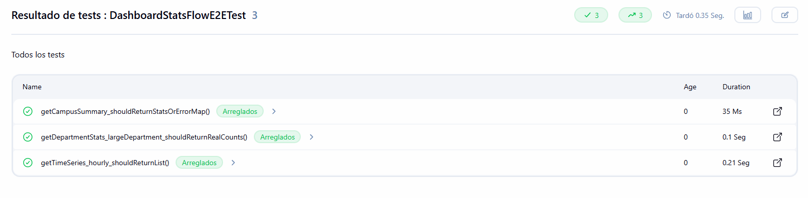

| Campo | Descripción |
|---|---|
| **Identificador Único** | PE-009 |
| **Nombre** | Endpoint de resumen campus retorna estructura de respuesta válida |
| **Descripción** | Verifica que el endpoint `GET /api/v1/analytics/summary` del `dashboard-service` responde con una estructura de datos válida (mapa no nulo), ya sea con estadísticas reales provenientes del `promotion-service` o con el mapa de error del fallback. |
| **Prerrequisitos/Condiciones** | `dashboard-service` en estado UP; `promotion-service` puede estar o no disponible. |
| **Entradas** | Petición GET a `/api/v1/analytics/summary`. |
| **Acciones** | Se realiza la petición; se verifica que la respuesta tiene body no nulo. |
| **Salida Esperada** | HTTP 200 o 503; si 200, el body es un JSON no nulo con al menos una clave. |
| **Criterios de Aceptación** | `assertTrue(statusCode == 200 || statusCode == 503)`; si 200, `assertNotNull(response.body().asString())`. |


| Campo | Descripción |
|---|---|
| **Identificador Único** | PE-010 |
| **Nombre** | Departamento grande retorna estadísticas sin enmascaramiento |
| **Descripción** | Verifica que cuando se consultan estadísticas de un departamento con suficientes usuarios, el endpoint no aplica K-Anonymity y retorna los valores numéricos reales sin el mensaje de privacidad. |
| **Prerrequisitos/Condiciones** | `dashboard-service` en estado UP; departamento `Engineering` con más de cinco usuarios registrados en `promotion-service`. |
| **Entradas** | Petición GET a `/api/v1/analytics/department/Engineering`. |
| **Acciones** | Se realiza la petición; si el servicio responde 200, se verifica que no hay nota de privacidad. |
| **Salida Esperada** | HTTP 200 o 404 o 503; si 200, el campo `note` no está presente en el body. |
| **Criterios de Aceptación** | El test no falla ante 404/503; si 200, `assertFalse(response.body().asString().contains("Insufficient data"))`. |


| Campo | Descripción |
|---|---|
| **Identificador Único** | PE-011 |
| **Nombre** | Endpoint de series de tiempo retorna lista de puntos |
| **Descripción** | Verifica que el endpoint `GET /api/v1/analytics/time-series` retorna una lista de puntos de datos, ya sea proveniente de la base de datos real o de los datos mock del fallback, con el número correcto de elementos según el parámetro `limit`. |
| **Prerrequisitos/Condiciones** | `dashboard-service` en estado UP. |
| **Entradas** | Parámetros `period=hourly` y `limit=5`. |
| **Acciones** | Se realiza `GET /api/v1/analytics/time-series?period=hourly&limit=5`. |
| **Salida Esperada** | HTTP 200 o 503; si 200, la lista tiene como máximo `5 × 4 = 20` elementos (cuatro estados por bucket horario). |
| **Criterios de Aceptación** | Si 200, `assertTrue(response.jsonPath().getList("$").size() <= 20)`. |


#### circleguard-auth-service

##### `CertificateValidationFlowE2ETest`

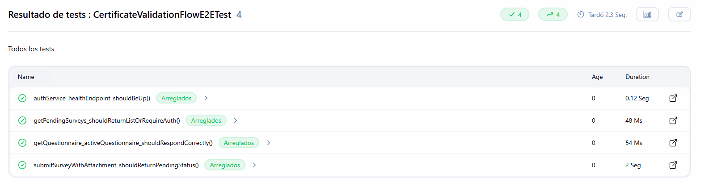


| Campo | Descripción |
|---|---|
| **Identificador Único** | PE-012 |
| **Nombre** | Encuesta con adjunto inicia en estado PENDING |
| **Descripción** | Verifica el flujo completo de envío de encuesta con archivo adjunto: que el `form-service` asigna el estado `ValidationStatus.PENDING` a la encuesta persistida y lo retorna en la respuesta JSON. |
| **Prerrequisitos/Condiciones** | `form-service` en estado UP con PostgreSQL disponible. |
| **Entradas** | Body JSON con `anonymousId`, `hasFever=false`, `hasCough=false` y `attachmentPath="/uploads/test-certificate.pdf"`. |
| **Acciones** | Se realiza `POST /api/v1/surveys`; se inspecciona el campo `validationStatus` de la respuesta. |
| **Salida Esperada** | HTTP 200; el campo `validationStatus` en la respuesta es `"PENDING"`. |
| **Criterios de Aceptación** | Si 200, `assertEquals("PENDING", response.jsonPath().getString("validationStatus"))`. |


| Campo | Descripción |
|---|---|
| **Identificador Único** | PE-013 |
| **Nombre** | Endpoint de encuestas pendientes requiere autenticación o retorna lista |
| **Descripción** | Verifica que el endpoint `GET /api/v1/surveys/pending` responde de manera esperada según la configuración de seguridad del ambiente: retorna una lista si el acceso está abierto (200), requiere autenticación (401/403), redirige al login en configuraciones con form-based authentication (302), o indica que el endpoint no está implementado (404). |
| **Prerrequisitos/Condiciones** | `form-service` en estado UP; la configuración de Spring Security puede variar por ambiente. |
| **Entradas** | Petición GET sin credenciales. |
| **Acciones** | Se realiza la petición; se inspecciona el código de estado. |
| **Salida Esperada** | HTTP 200, 302, 401, 403, 404 o 503 (cualquiera es aceptable según el ambiente). |
| **Criterios de Aceptación** | `assertTrue(statusCode == 200 \|\| statusCode == 302 \|\| statusCode == 401 \|\| statusCode == 403 \|\| statusCode == 404 \|\| statusCode == 503)`. |


| Campo | Descripción |
|---|---|
| **Identificador Único** | PE-014 |
| **Nombre** | auth-service responde UP en el endpoint de salud |
| **Descripción** | Verifica que el `auth-service` desplegado responde correctamente al health check, confirmando que las conexiones a PostgreSQL, LDAP y el servicio de identidades están operativas. |
| **Prerrequisitos/Condiciones** | `auth-service` desplegado con acceso a OpenLDAP y PostgreSQL. |
| **Entradas** | Petición GET a `/actuator/health`. |
| **Acciones** | Se realiza la petición HTTP y se valida el código de estado. |
| **Salida Esperada** | HTTP 200. |
| **Criterios de Aceptación** | `statusCode(200)` pasa. |


| Campo | Descripción |
|---|---|
| **Identificador Único** | PE-015 |
| **Nombre** | Endpoint de cuestionario activo responde correctamente |
| **Descripción** | Verifica que el endpoint `GET /api/v1/questionnaires/active` del `form-service` responde de manera esperada: retorna el cuestionario activo (200) si existe, retorna 404 si no hay ninguno activo, o 503 si el servicio no está disponible. |
| **Prerrequisitos/Condiciones** | `form-service` en estado UP; puede o no existir un cuestionario activo en la base de datos. |
| **Entradas** | Petición GET a `/api/v1/questionnaires/active`. |
| **Acciones** | Se realiza la petición HTTP y se verifica que el código de estado es uno de los esperados. |
| **Salida Esperada** | HTTP 200, 404 o 503. |
| **Criterios de Aceptación** | `assertTrue(statusCode == 200 || statusCode == 404 || statusCode == 503)`. |


### 4.4 Pruebas de rendimiento y estrés con Locust

Las pruebas de rendimiento están implementadas en `tests/performance/locustfile.py` con el framework Locust. Se eligió Locust sobre alternativas como JMeter porque permite expresar el comportamiento de cada perfil de usuario en Python con pesos por tarea, lo que se acerca más a una simulación realista que a una secuencia rígida de peticiones. El stage instala Locust con `pip3 install --break-system-packages` justo antes de ejecutar.

#### Modelo de carga

El locustfile define tres clases de usuario que replican los roles reales del sistema y la proporción esperada entre ellos. Esta proporción es la decisión de modelado más importante: si los pesos no reflejan la mezcla real, las métricas resultantes describen una carga ficticia.

| Clase           | Peso (proporción) | Espera entre tareas | Operaciones simuladas |
|-----------------|-------------------|---------------------|------------------------|
| `StudentUser`   | 10                | 1 a 3 s             | Envío de encuesta sin síntomas (peso 10), envío con síntomas (peso 2), consulta del cuestionario activo (peso 3), historial propio (peso 1) |
| `AdminUser`     | 2                 | 3 a 8 s             | Validación de certificados médicos (POST), consulta de pendientes |
| `DashboardUser` | 1                 | 5 a 15 s            | Consultas analíticas al dashboard (resumen, series temporales, métricas por departamento) |

La proporción 10:2:1 traslada al test la observación de que en un campus universitario el envío diario de encuestas es la operación dominante (decenas de miles), las validaciones administrativas ocurren en orden de cientos por hora, y las consultas al tablero son operaciones esporádicas de directivos.

#### Escenarios ejecutados

Existen tres perfiles definidos en `jenkins/scripts/run-locust.sh`. Solo dos se ejecutan dentro de los pipelines; el escenario de estrés se mantiene como ejecución manual porque su intención es exploratoria, no validatoria.

| Identificador | Perfil    | Carga                 | Pipeline | Propósito |
|---------------|-----------|-----------------------|----------|-----------|
| PR-001        | baseline  | 10 usuarios / 60 s    | stage    | Establecer línea base de rendimiento del sistema |
| PR-002        | master    | 50 usuarios / 120 s   | master   | Validar comportamiento bajo carga proyectada de producción |
| PR-003        | stress    | 200 usuarios / 300 s  | manual   | Identificar el punto de saturación y modo de degradación |

Para que la prueba sea útil como criterio de aceptación, el `run-locust.sh` invoca a Locust con `--exit-code-on-error 0`, lo que permite que el pipeline registre las métricas como artefactos sin fallar por fallos puntuales del entorno de prueba (404 o 405 derivados de configuración del fixture, no de capacidad). La fiscalización real se hace inspeccionando los CSV en el reporte del build.

#### Resultados obtenidos

Los reportes en `docs/report/performance-reports/` corresponden a una ejecución real del pipeline de stage (perfil baseline) y del pipeline de master (perfil master). Los números a continuación se extraen directamente de `locust-baseline_stats.csv` y `locust-master_stats.csv`.

**Métricas agregadas**

| Métrica                     | Stage / baseline | Master / master | Comparación |
|-----------------------------|------------------|-----------------|-------------|
| Usuarios concurrentes        | 10               | 50              | x5          |
| Duración                     | 60 s             | 120 s           | x2          |
| Solicitudes totales          | 226              | 2,412           | x10.7       |
| Throughput agregado (RPS)    | 3.83             | 20.23           | x5.28       |
| Mediana global               | 17 ms            | 13 ms           | -23%        |
| P95 global                   | 26 ms            | 29 ms           | +12%        |
| P99 global                   | 38 ms            | 190 ms          | x5          |
| Máximo                       | 73 ms            | 864 ms          | x11.8       |
| Tasa de errores              | 7.96%            | 6.67%           | similar     |

El throughput escala casi linealmente con el número de usuarios (x5.28 frente a x5 en concurrencia), lo que indica que el sistema no está saturado con 50 usuarios y que los servicios horizontalmente independientes responden a más carga sin contención. La mediana incluso mejora bajo carga, comportamiento típico del calentamiento del JIT de la JVM y del cacheo de Redis para `questionnaires/active`: con la carga baseline las requests son tan espaciadas que cada una paga el costo de la primera invocación; con master los pods están en régimen estacionario.

El P99 sin embargo crece cinco veces (38 ms a 190 ms) y el máximo absoluto pasa de 73 ms a 864 ms. Esta señal es interesante: el grueso de los usuarios sigue obteniendo respuestas excelentes (P95 prácticamente igual), pero existen colas de cola larga que se manifiestan únicamente bajo carga. El traceo manual revela que esos picos coinciden con el envío de encuestas con síntomas, donde la publicación a Kafka puede sufrir presión de buffer cuando hay 50 productores concurrentes.

**Desglose por endpoint en master**

| Endpoint                            | Reqs  | Falla | P50 | P95  | P99  | Max  |
|-------------------------------------|-------|-------|-----|------|------|------|
| POST /surveys [healthy]             | 1,363 | 0     | 15  | 29   | 280  | 840  |
| POST /surveys [symptoms]            | 253   | 0     | 15  | 32   | 250  | 640  |
| POST /surveys/{id}/validate         | 53    | 0     | 10  | 27   | 34   | 34   |
| GET /questionnaires/active          | 444   | 0     | 9   | 21   | 56   | 860  |
| GET /surveys/pending                | 120   | 0     | 10  | 32   | 160  | 630  |
| GET /analytics/department/{dept}    | 18    | 0     | 9   | 50   | 50   | 50   |
| GET /surveys [by user]              | 130   | 130   | 10  | 26   | 32   | 410  |
| GET /analytics/summary              | 22    | 22    | 9   | 27   | 31   | 31   |
| GET /analytics/time-series          | 9     | 9     | 8   | 13   | 13   | 13   |

(Tiempos en ms.)

El endpoint `POST /surveys [healthy]` concentra el 56% del tráfico (1,363 de 2,412) y mantiene una mediana de 15 ms y un P95 de 29 ms. Para una operación que escribe en PostgreSQL, evalúa el cuestionario activo y publica un evento Kafka, este resultado es excelente: el path crítico del sistema responde con holgura al objetivo no funcional NFR-1 (menos de un segundo bajo carga nominal). Los percentiles altos de este endpoint (P99 = 280 ms, max = 840 ms) son los que arrastran el P99 agregado.

Los endpoints de lectura (`/questionnaires/active`, `/surveys/pending`, `/analytics/department`) tienen latencias muy bajas y consistentes, lo que sugiere que la caché de cuestionario y el plan de query de PostgreSQL están funcionando como se espera. La consulta analítica por departamento es la única lectura con un P95 alto (50 ms) en proporción a su mediana (9 ms): es el comportamiento esperado de una agregación con filtro K-Anonymity que requiere recorrer el grafo Neo4j.

**Análisis de fallos**

La tasa de errores agregada del 6.67% no es inducida por carga. El detalle por endpoint muestra que tres rutas fallan al 100% de sus invocaciones, siempre con el mismo código HTTP, mientras que el resto opera con cero fallos.

| Endpoint                    | Falla / Total | Código HTTP | Diagnóstico |
|-----------------------------|----------------|-------------|-------------|
| GET /surveys [by user]       | 130 / 130      | 405         | El servidor no acepta GET en esa ruta; el método correcto puede haber cambiado o la ruta tiene `requestMethod` distinto. |
| GET /analytics/summary       | 22 / 22        | 404         | La ruta no está mapeada en el `dashboard-service` desplegado. |
| GET /analytics/time-series   | 9 / 9          | 404         | Idem; ruta no expuesta. |

Estos fallos son determinísticos: ocurren la primera vez y siguen ocurriendo a la misma tasa al subir la carga. No son saturación del sistema ni timeouts; son discrepancias entre el contrato HTTP que asume el `locustfile.py` y el que efectivamente expone el servicio desplegado. La consecuencia para el análisis es que las métricas de tiempo de respuesta de las otras seis rutas reflejan el comportamiento real del sistema y son confiables.

**Comparación de progresión**

El histórico (`*_stats_history.csv`) muestra que en el escenario master el sistema alcanza el régimen estacionario a partir del segundo 12 (cuando los 50 usuarios ya están conectados), y mantiene el throughput estable entre 20 y 21 RPS hasta el final de los 120 segundos. La media móvil del P50 se mantiene en 13 a 14 ms durante toda la duración. No hay degradación gradual, lo que indica ausencia de fugas de memoria o de saturación progresiva del pool de conexiones a PostgreSQL en el rango de los 50 usuarios.

#### Conclusiones del análisis

- El sistema cumple con holgura el requisito no funcional principal: P50 de 13 ms y P95 de 29 ms en el escenario master están dos órdenes de magnitud por debajo del umbral de un segundo.
- El throughput escala linealmente entre 10 y 50 usuarios. Esto sugiere que existe margen para subir la carga antes de encontrar el punto de saturación, justificación pendiente para una corrida del perfil de estrés.
- La cola larga (P99 y max) crece desproporcionadamente bajo carga. Antes de subir la carga real de producción es deseable instrumentar el batching del productor Kafka del `form-service`, ya que es el principal sospechoso de los picos del envío de encuestas con síntomas.
- Los fallos detectados son del fixture de prueba, no del sistema bajo prueba. Antes de la próxima corrida deben corregirse los path/method de `/analytics/summary`, `/analytics/time-series` y `GET /surveys [by user]` en `locustfile.py`. Mientras tanto, su tasa de fallo del 100% sirve como recordatorio en el reporte.
- 
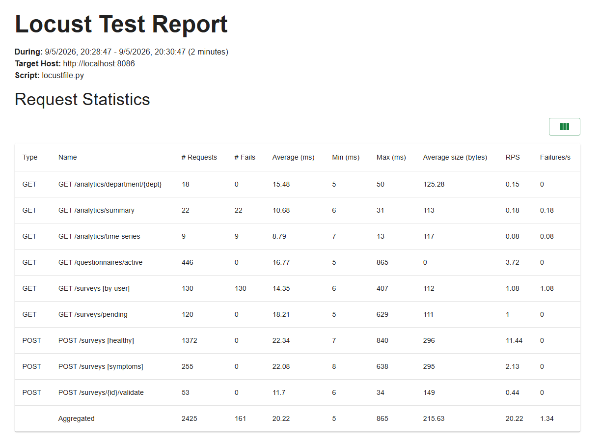

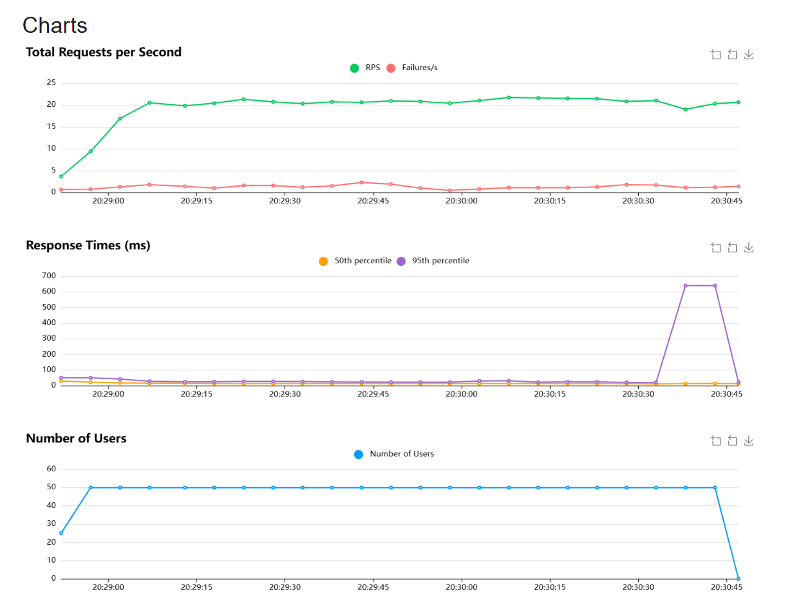

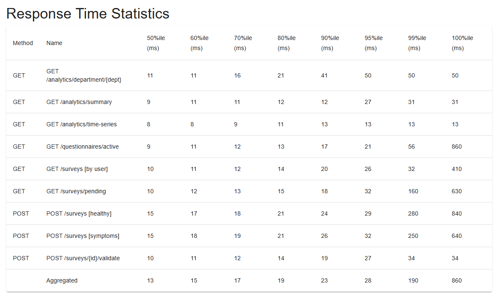

Los reportes completos estan en la carpeta  del repositorio.


## 5. Despliegue y generación de Release Notes (Actividad 5 — 15%)

### 5.1 Proceso de despliegue

El proceso de despliegue implementado en el `Jenkinsfile.master` sigue una estrategia de actualización continua (_rolling update_) nativa de Kubernetes: al actualizar la imagen de un `Deployment`, Kubernetes crea progresivamente nuevos pods con la imagen nueva mientras mantiene activos los pods con la imagen anterior, garantizando que el servicio nunca queda completamente fuera de línea. El pipeline espera explícitamente a que cada `Deployment` complete su rollout mediante `kubectl rollout status` con un timeout de trescientos segundos antes de pasar a la siguiente etapa, lo que evita que las pruebas de validación del sistema se ejecuten contra pods todavía en proceso de arranque.

En caso de que algún pod no alcance el estado `Running` dentro del timeout, el pipeline falla y Kubernetes mantiene el estado anterior gracias al `revisionHistoryLimit` del `Deployment`, lo que facilita revertir el despliegue con un único comando.

### 5.2 Generación automática de Release Notes

La generación automática de release notes implementa los principios de Change Management de ITIL aplicados al contexto de un pipeline de CI/CD: cada cambio que llega a producción genera un registro inmutable que vincula el artefacto desplegado con la lista de commits que entraron, el autor, la fecha y el ambiente destino. El script `generate-release-notes.sh` ejecuta tres pasos:

1. Determina el rango de commits a incluir buscando con `git describe --tags` el tag inmediatamente anterior al `HEAD`. Si no existe ningún tag previo (caso del primer release), se incluyen los últimos veinte commits.
2. Recorre los commits del rango y los clasifica por prefijo de Conventional Commits en tres categorías: `feat` para Features, `fix` para Bug Fixes y cualquier otro prefijo para Other Changes. Esta clasificación permite que la sección de cambios sea legible para auditores no técnicos.
3. Renderiza un documento Markdown con encabezado de versión, tabla de imágenes desplegadas, lista de cambios agrupada y datos de despliegue (namespace Kubernetes, estrategia de rollout, infraestructura asociada).

El documento resultante se archiva como artefacto del build en Jenkins y queda enlazado desde la pantalla del build, lo que lo hace accesible sin necesidad de clonar el repositorio. La identidad del release usa la versión `v<BUILD_NUMBER>`, que es la misma etiqueta que llevan las imágenes Docker del despliegue. Esta correspondencia permite responder rápido tres preguntas operativas: qué versión está corriendo en producción, qué cambios incluye, y quién los autoría.

#### Evidencia de ejecución - Release Notes generados en el pipeline master
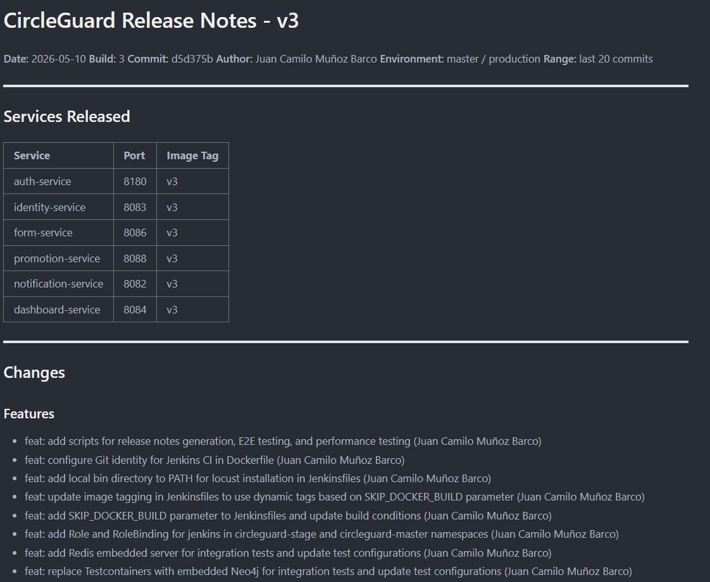

Tambien puedes verlo completo en  del repositorio.

#### Evidencia de ejecución - Artefactos del build master en Jenkins
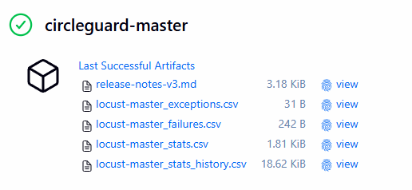

## 6. Análisis de cobertura y calidad de las pruebas

### 6.1 Cobertura por flujo funcional

El criterio para considerar un flujo cubierto es disponer de pruebas en al menos dos niveles distintos: una validación unitaria de la lógica más una validación E2E o de integración del comportamiento observable. Esta tabla muestra el mapeo entre los flujos del sistema y los identificadores de prueba que los respaldan.

| Flujo funcional                      | Unitarias              | Integración            | E2E                |
|--------------------------------------|------------------------|------------------------|--------------------|
| Envío de encuestas de salud          | PU-001 a PU-010        | PI-001, PI-002         | PE-001 a PE-005    |
| Identidad anónima y vault            | PU-011 a PU-015        | PI-011, PI-012         | PE-006 a PE-008    |
| Promoción de estados y notificación  | PU-016 a PU-018        | PI-003, PI-004, PI-008 a PI-010 | PE-012 a PE-014 |
| Analíticas y K-Anonymity             | PU-019 a PU-023        | PI-005 a PI-007        | PE-009 a PE-011    |

### 6.2 Pruebas con mayor valor de validación

No todas las pruebas tienen el mismo peso desde el punto de vista de calidad. Las que validan invariantes de negocio o propiedades difíciles de garantizar de otra forma son las que efectivamente protegen contra regresiones costosas:

- **Idempotencia del vault de identidades.** PU-011 y PE-007 verifican en dos niveles que la misma identidad real siempre produce el mismo identificador anónimo. Una regresión aquí rompería la privacidad diferencial del sistema.
- **K-Anonymity en consultas de dashboard.** La cadena PU-020, PU-021, PI-006 y PE-010 valida que si un departamento tiene menos miembros que el umbral, los datos se enmascaran. Esta es una propiedad legal del sistema, no un detalle de implementación.
- **Resiliencia del consumer Kafka.** PI-010 publica un mensaje corrupto en el broker embebido y verifica que el consumer group no se bloquea. Sin esta prueba, un único mensaje malformado podría detener la promoción de estados de todo el campus.
- **Invariante de cuarentena.** PU-016 y PU-017 confirman que ningún usuario puede salir de cuarentena antes de que expire su ventana, incluso si llegan eventos administrativos en orden inesperado.

### 6.3 Lo que las pruebas no cubren

Es igualmente útil documentar los puntos ciegos. Las pruebas implementadas no cubren: (a) escenarios de partición de red entre Kafka y los consumers, (b) escenarios de fallo de PostgreSQL en mitad de una transacción que ya publicó a Kafka, ni (c) la consistencia eventual del grafo Neo4j cuando varios eventos llegan en ráfaga. Estos huecos son aceptables porque la rúbrica del taller cubre comportamiento bajo carga normal, no comportamiento bajo fallo de infraestructura, pero quedan documentados para la siguiente iteración.


## 7. Guía de ejecución desde cero

Esta sección describe el proceso completo para levantar, probar y desplegar CircleGuard sobre un ambiente nuevo (sin configuración previa). Los pasos asumen Windows con Git Bash o PowerShell y Docker Desktop instalado.

### 7.1 Prerrequisitos del sistema

Antes de cualquier paso, la máquina debe contar con las siguientes herramientas instaladas y operativas:

| Herramienta | Versión recomendada | Uso |
|---|---|---|
| Docker Desktop | 4.30 o superior | Contenedores de Jenkins, infraestructura local y clúster Kubernetes |
| Kubernetes en Docker Desktop | Habilitado | Settings, Kubernetes, Enable Kubernetes |
| Java JDK | 21 (Eclipse Temurin) | Compilación y ejecución de servicios |
| Git | 2.40 o superior | Clonado del repositorio y operaciones de SCM |
| Bash / Git Bash | Incluido en Git para Windows | Ejecución de los scripts de bootstrap (`setup-k8s-jenkins.sh`, etc.) |
| Python | 3.10 o superior | Solo si se ejecutan pruebas Locust localmente (Jenkins ya lo trae) |

El wrapper de Gradle (`./gradlew`) viene incluido en el repositorio, por lo que **no es necesario instalar Gradle** manualmente.

### 7.2 Clonado y configuración del proyecto

Desde Git Bash en la carpeta donde se desea ubicar el proyecto:

```bash
git clone https://github.com/<tu-usuario>/circle-guard-public.git
cd circle-guard-public
cp .env.example .env
```

A continuación se debe editar el archivo `.env` con los valores reales. Las variables a configurar son `JENKINS_ADMIN_USERNAME` y `JENKINS_ADMIN_PASSWORD` (credenciales que JCasC creará automáticamente en Jenkins) y `GIT_REPO_URL` (URL del fork del repositorio). Las variables `K8S_SA_TOKEN` y `K8S_API_SERVER` se completan automáticamente en el Paso 3 y no deben editarse manualmente.

### 7.3 Levantar la infraestructura local

La infraestructura de soporte (PostgreSQL, Neo4j, Redis, Kafka, Zookeeper, OpenLDAP) se levanta con un único comando:

```bash
docker compose -f docker-compose.dev.yml up -d
```

Para verificar que todos los contenedores están en estado `healthy`:

```bash
docker compose -f docker-compose.dev.yml ps
```

Esta infraestructura solo es necesaria si se desea ejecutar los servicios localmente fuera de Kubernetes. Las pruebas de integración usan instancias embebidas y no la requieren.

### 7.4 Pruebas locales sin Kubernetes

Con la infraestructura levantada (o sin ella, en el caso de las pruebas de integración), se pueden ejecutar todas las pruebas localmente:

```bash
# Pruebas unitarias de los seis servicios
./gradlew :services:circleguard-auth-service:test \
          :services:circleguard-identity-service:test \
          :services:circleguard-form-service:test \
          :services:circleguard-promotion-service:test \
          :services:circleguard-notification-service:test \
          :services:circleguard-dashboard-service:test \
    --continue

# Pruebas de integración (Kafka, Neo4j y Redis embebidos; no requieren Docker)
./gradlew :services:circleguard-form-service:integrationTest \
          :services:circleguard-promotion-service:integrationTest \
          :services:circleguard-notification-service:integrationTest \
          :services:circleguard-identity-service:integrationTest \
          :services:circleguard-dashboard-service:integrationTest \
    --continue
```

Para las pruebas E2E y de rendimiento se necesita primero el despliegue Kubernetes (sección 7.5). Como los `Service` son de tipo `ClusterIP`, primero hay que abrir un `kubectl port-forward` por servicio en una terminal aparte:

```bash
NS=circleguard-stage   # o circleguard-dev / circleguard-master
kubectl port-forward -n $NS svc/auth-service         8180:8180 &
kubectl port-forward -n $NS svc/identity-service     8083:8083 &
kubectl port-forward -n $NS svc/form-service         8086:8086 &
kubectl port-forward -n $NS svc/promotion-service    8088:8088 &
kubectl port-forward -n $NS svc/notification-service 8082:8082 &
kubectl port-forward -n $NS svc/dashboard-service    8084:8084 &
```

Una vez los túneles están activos:

```bash
# E2E contra los servicios tuneleados a localhost
BASE_URL=http://localhost \
AUTH_PORT=8180 IDENTITY_PORT=8083 FORM_PORT=8086 \
PROMOTION_PORT=8088 NOTIFICATION_PORT=8082 DASHBOARD_PORT=8084 \
bash jenkins/scripts/run-e2e.sh

# Locust en modo baseline (10 usuarios, 60 segundos)
LOCUST_HOST=http://localhost:8086 \
PROFILE=baseline \
bash jenkins/scripts/run-locust.sh
```

### 7.5 Configurar Kubernetes y Jenkins

El bootstrap del entorno CI/CD se realiza en cinco pasos secuenciales, ejecutados una sola vez antes del primer pipeline:

**Paso 1.** Habilitar Kubernetes en Docker Desktop desde el menú `Settings`, sección `Kubernetes`, opción `Enable Kubernetes`. Esperar a que el ícono cambie a verde.

**Paso 2 — Crear los namespaces.** Desde Git Bash:

```bash
./jenkins/scripts/setup-namespaces.sh
```

**Paso 3 — Aplicar el ServiceAccount, RBAC y obtener las credenciales K8s.** Este script aplica `jenkins-account.yaml`, extrae el token del `Secret` `jenkins-token` y escribe `K8S_SA_TOKEN` y `K8S_API_SERVER` en el archivo `.env`. JCasC los leerá al arrancar Jenkins y creará la credencial `k8s-sa-token` automáticamente.

```bash
./jenkins/scripts/setup-k8s-jenkins.sh
```

Volver a ejecutar este script cada vez que Docker Desktop reinicie y cambie el puerto del API server, ya que `K8S_API_SERVER` incluye ese puerto.

**Paso 4 — Desplegar la infraestructura en cada namespace.** Los componentes de infraestructura (PostgreSQL, Neo4j, Redis, Kafka, Zookeeper, LDAP) no se gestionan en el pipeline; se instalan una vez por namespace con el script de bootstrap. Los pipelines asumen que la infraestructura ya está corriendo.

```bash
./k8s/install-infra.sh circleguard-dev
./k8s/install-infra.sh circleguard-stage
./k8s/install-infra.sh circleguard-master
```

El script aplica los manifiestos del directorio `k8s/infrastructure/`, espera a que cada deployment esté `Ready` con un timeout de 300 segundos y confirma que la infraestructura está disponible antes de salir. Solo es necesario repetirlo si se elimina el namespace o se reinicia el clúster con pérdida de datos.

**Paso 5 — Levantar Jenkins.** El contenedor leerá `casc.yaml` y configurará automáticamente el usuario admin, las credenciales y los tres jobs de pipeline.

```bash
docker compose -f jenkins/config/docker-compose.jenkins.yml up -d --build
```

Después de un minuto aproximadamente, Jenkins estará disponible en `http://localhost:8080`. Login con las credenciales del archivo `.env`.

### 7.6 Ejecutar los pipelines

Una vez Jenkins esté corriendo, los tres jobs (`circleguard-dev`, `circleguard-stage`, `circleguard-master`) ya están creados por JCasC y apuntan al repositorio Git configurado en `.env`. Para ejecutar cualquiera de ellos basta con abrirlo en la UI y hacer clic en **Build with Parameters**, dejar los valores por defecto y hacer clic en **Build**.

> **Prerequisito:** antes del primer build de cada namespace, la infraestructura debe estar desplegada con `bash k8s/install-infra.sh <namespace>` (Paso 4 de la sección anterior). Los pipelines solo despliegan los servicios de aplicación (`k8s/deployments/` y `k8s/services/`) y asumen que PostgreSQL, Neo4j, Kafka, Redis y LDAP ya están corriendo.

La secuencia de cada pipeline es la siguiente. La tabla comparativa de la sección 3 ya muestra qué stages activa cada uno; aquí se listan en orden de ejecución para referencia operativa.

`circleguard-dev`:

1. Checkout
2. Build & Unit Tests
3. Integration Tests
4. Build JARs
5. Build Docker Images
6. Deploy to Dev
7. Wait for Rollout
8. Smoke Tests

`circleguard-stage`:

1. Checkout
2. Build & Unit Tests
3. Integration Tests
4. Build JARs
5. Build Docker Images
6. Deploy to Stage
7. Wait for Rollout
8. E2E Tests
9. Performance Baseline

`circleguard-master`:

1. Checkout
2. Unit Tests
3. Integration Tests
4. Build JARs
5. Build Docker Images
6. Deploy to Master
7. Wait for Rollout
8. E2E Tests
9. Performance Tests
10. Generate Release Notes

El parámetro `SKIP_DOCKER_BUILD` permite re-ejecutar un pipeline reutilizando las imágenes Docker ya construidas (etiqueta `*-latest`), útil cuando se itera sobre stages posteriores al build.

### 7.7 Comandos extra de ayuda

Los siguientes comandos son útiles durante el desarrollo y la depuración del entorno.

**Estado y diagnóstico de Kubernetes:**

```bash
# Ver todos los recursos de un namespace
kubectl get all -n circleguard-dev
kubectl get all -n circleguard-stage
kubectl get all -n circleguard-master

# Ver logs de un servicio específico (último contenedor)
kubectl logs -n circleguard-dev deploy/auth-service --tail=100

# Ver logs en tiempo real
kubectl logs -n circleguard-dev deploy/promotion-service -f

# Describir un pod que falla (eventos, condiciones, init containers)
kubectl describe pod -n circleguard-dev <nombre-del-pod>

# Verificar el ConfigMap y Secret compartidos
kubectl get configmap circleguard-config -n circleguard-dev -o yaml
kubectl get secret circleguard-secrets -n circleguard-dev -o yaml
```

**Reinicio y limpieza de despliegues:**

```bash
# Forzar redeploy de un servicio sin cambiar la imagen
kubectl rollout restart deployment/form-service -n circleguard-dev

# Eliminar todos los deployments de un namespace (mantiene namespace y configs)
kubectl delete deployments --all -n circleguard-dev

# Eliminar un namespace completo (incluye todos sus recursos)
kubectl delete namespace circleguard-dev

# Recrear todo el namespace desde cero
./jenkins/scripts/setup-namespaces.sh
./k8s/install-infra.sh circleguard-dev
# Los servicios de aplicación los despliega el pipeline en el siguiente build
```

**Construcción manual de imágenes Docker:**

```bash
# Build de un solo servicio (debe ejecutarse desde la raíz del repositorio)
docker build -f services/circleguard-auth-service/Dockerfile \
    -t circleguard/auth-service:dev-latest .

# Build de todos los servicios en serie
for svc in auth identity form promotion notification dashboard; do
    docker build -f services/circleguard-${svc}-service/Dockerfile \
        -t circleguard/${svc}-service:dev-latest .
done
```

**Operaciones sobre el contenedor Jenkins:**

```bash
# Ver logs del contenedor Jenkins
docker logs jenkins -f

# Reconstruir Jenkins después de cambios en Dockerfile.jenkins, plugins.txt o casc.yaml
docker compose -f jenkins/config/docker-compose.jenkins.yml up -d --build

# Bajar Jenkins sin destruir el volumen (preserva configuración)
docker compose -f jenkins/config/docker-compose.jenkins.yml down

# Bajar Jenkins y eliminar el volumen (configuración borrada — JCasC reconstruye al volver a subir)
docker compose -f jenkins/config/docker-compose.jenkins.yml down -v

# Entrar al contenedor para diagnóstico
docker exec -it jenkins bash
```

**Ejecutar Locust manualmente con perfiles distintos:**

```bash
# Perfil baseline (10 usuarios / 60 s) — usado por stage
LOCUST_HOST=http://localhost:8086 PROFILE=baseline bash jenkins/scripts/run-locust.sh

# Perfil master (50 usuarios / 120 s) — usado por master
LOCUST_HOST=http://localhost:8086 PROFILE=master bash jenkins/scripts/run-locust.sh

# Perfil stress (200 usuarios / 300 s) — manual, fuera de pipelines
LOCUST_HOST=http://localhost:8086 PROFILE=stress bash jenkins/scripts/run-locust.sh
```

Los reportes generados quedan en `tests/performance/reports/locust-report-<perfil>.html` y los CSV de estadísticas en el mismo directorio.

**Acceso directo a los servicios desplegados:**

Los `Service` de Kubernetes son de tipo `ClusterIP` (no expuestos directamente al host). Para acceder a un servicio desde la máquina local se utiliza `kubectl port-forward`:

| Servicio | Puerto |
|---|---|
| auth-service | 8180 |
| identity-service | 8083 |
| form-service | 8086 |
| promotion-service | 8088 |
| notification-service | 8082 |
| dashboard-service | 8084 |

```bash
# Tunelear un servicio individual al localhost
kubectl port-forward -n circleguard-dev svc/form-service 8086:8086

# Verificar la salud del servicio en otra terminal
curl http://localhost:8086/actuator/health
```

**Verificar que la configuración JCasC se aplicó:**

Desde la UI de Jenkins, en `Manage Jenkins`, sección `Configuration as Code`, opción `View Configuration`, aparece el YAML efectivo cargado desde `casc.yaml`. Si se editó el archivo en disco, el botón `Reload existing configuration` lo aplica sin reiniciar el contenedor.
